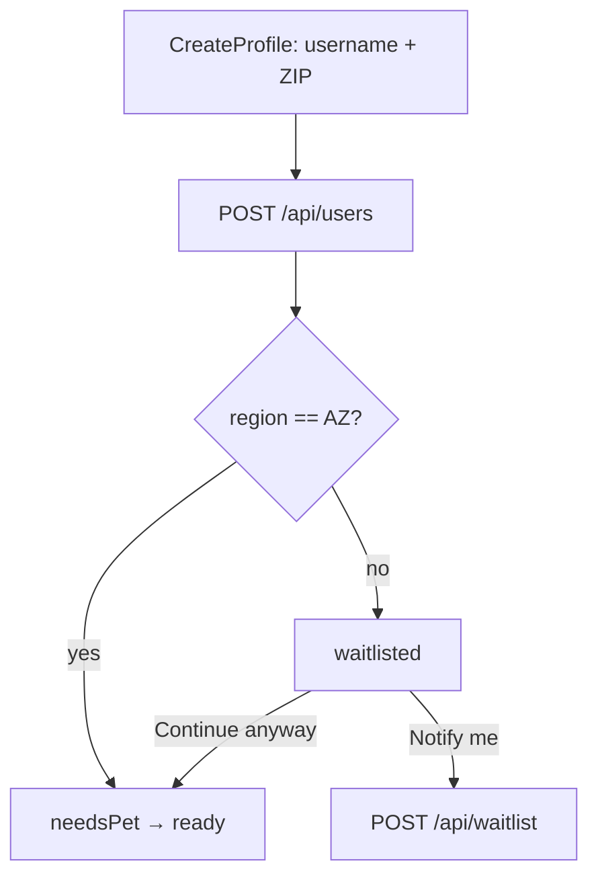

# Arizona launch — fence, waitlist, and every city over 250k

Status: **built and verified** (2026-09-10) - backend 99/99 on the touched
suites, session/waitlist/hub suites green, lint/types/colours clean. Decided
with you 2026-09-10. Not yet run against a real environment:
`npm run import:arizona` (needs `GOOGLE_MAPS_API_KEY` and `MONGODB_URI`;
`--dry-run` lists the 48 searches). One correction from the first draft: 853
is Yuma, not unassigned - the test caught it.

## Goal

Every dead competitor launched nationally into an empty deck. This app launches
in **Arizona** - the whole state, not one metro - and everyone else joins a
waitlist that tells us where the next launch should be. The places directory is
pre-seeded for every Arizona city over 250,000 so a first user in Glendale sees
vets, parks, patios and hotels on day one rather than an import spinner.

## Decisions

- **The fence signal is a ZIP code**, asked once on `CreateProfile`. Location
  sharing is optional by design, so the fence cannot depend on it; the ZIP is
  also the only thing that tells the waitlist *where* demand is. Arizona ZIPs
  are the `850`–`865` prefixes. A device position that later arrives outside
  Arizona does not evict anybody - a Phoenix owner on holiday is still a
  Phoenix owner.
- **Out-of-area is a session state, `waitlisted`**, like `suspended`. One
  screen, one "Notify me" button. The email is already on the Firebase account,
  so the tap writes a `Waitlist` row (`user`, `zip`, `state`, `createdDate`)
  and nothing is typed. They can still add a pet and use the care hub via a
  "Continue anyway" link - the research's durable half is the care hub, and a
  waitlist that locks it out throws that away.
- **Six seed cities** (Census Vintage 2025, July 1 2025 estimates —
  [citypopulation.de](https://www.citypopulation.de/en/usa/cities/arizona/),
  matching the Census tables): Phoenix 1,665,481 · Tucson 548,371 · Mesa
  513,656 · Gilbert 287,285 · Chandler 278,748 · Glendale 260,572. Scottsdale
  is 243,006 and out; it sits inside Phoenix's import radius regardless.
- **Pet-friendly places via Google keyword**, three new categories on
  `placeCategories.js`: `patio` (`restaurant` + "dog friendly patio"), `hotel`
  (`lodging` + "pet friendly hotel"), `trail` (`park` + "dog friendly hiking
  trail"). Google has no dog-friendly type, so precision is what the keyword
  gives; the category the search was for is carried onto the row, exactly as
  groomers are today.

## Architecture

- `User.zip` (String, 5 digits) and `User.region` ("AZ" | "other", derived on
  save from the ZIP prefix - one table in `services/regions.js`, the only place
  that rule is written). `/api/users/me` projects `region`;
  `statusForProfile` returns `waitlisted` when `region !== "AZ"` and the user
  has not chosen "continue anyway" (stored per user in AsyncStorage like the
  pet-setup skip). `RootNavigator` mounts `WaitlistScreen` for it.
- `Waitlist` model + `POST /api/waitlist` (idempotent: upsert on `user`).
  `check:auth` is satisfied because `user` comes from `req.userId`.
- `SUSPENDED_ALLOWED`-style allowance is **not** needed: a waitlisted account
  is not refused anything server-side; the fence is a session state only. The
  deck stays honest for anyone who continues anyway - it is just empty.
- `scripts/importArizona.js` in `backend/scripts/`: loops the six centres with
  a 12-mile radius through `places.importNear` (which now includes the new
  categories). Run once per environment; idempotent by `placeId`.
- The care hub gains a second heading, "Out and about", for `patio`, `hotel`,
  `trail`; `CARE_CATEGORIES` stays as-is so the vet list does not fill with
  hotels.

## Todos

| # | Task | Status |
| --- | --- | --- |
| 1 | `services/regions.js`: `regionForZip`, `LAUNCH_REGIONS = ["AZ"]`, AZ prefix table; test | todo |
| 2 | `User.zip`, `User.region` + pre-validate derive; `createUser` accepts `zip` (validated 5 digits); `/me` projects it; `settings.js` untouched (ZIP is identity-adjacent, not a preference) | todo |
| 3 | `Waitlist` model, `POST /api/waitlist` (upsert), `GET /api/waitlist/me`; `authAudit` passes as written | todo |
| 4 | App: ZIP field on `CreateProfileScreen`; `AuthSessionContext` `waitlisted` state + `continueAnyway()`; `WaitlistScreen` on `RootNavigator`; `api.ts` `SessionState` union | todo |
| 5 | `placeCategories.js`: `patio`, `hotel`, `trail` + `OUT_CATEGORIES`; `places.search` already takes keyword | todo |
| 6 | `backend/scripts/importArizona.js` with the six centres; `npm run import:arizona` | todo |
| 7 | `MoreScreen`: "Out and about" section with its own chips; `PLACE_LABELS` | todo |
| 8 | Tests: regions, waitlist (two accounts), session-state gate, `contract.test.js`, gallery board for the waitlist screen | todo |

## Env / setup

`GOOGLE_MAPS_API_KEY` on the backend (already documented). The import is
~6 cities × 8 categories × 20 results = ~960 billed Nearby Search requests, once.

## Risks

- **ZIP is self-reported.** Somebody types 85001 from Ohio and is in. That is
  fine - the fence is about not wasting a real Arizonan's first session, not
  about keeping anybody out.
- **Google keyword precision** for patios and hotels is mediocre; a place can
  be wrong. The card already lets owners save, and nothing here claims "dog
  friendly" as a verified fact - the section heading says "reported
  dog-friendly" and the place opens Google's page.
- **Existing accounts have no ZIP.** `region` stays undefined → treated as
  `AZ` for accounts created before the field (the same "rows predate the
  field" rule as `species`). Only new profiles are fenced.
