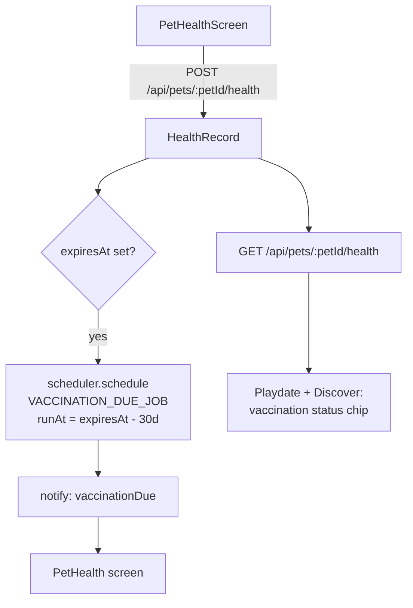

# Health records first — the feature that does four jobs

Status: **proposal** (not approved). Written 2026-09-09 against `main` @ `34d232b`.
Companion to [store-readiness.plan.md](store-readiness.plan.md), which fixes what
exists. This plan is about **what to build next and why**, from market research.

Scope note: another agent is working `store-readiness` in this tree. This plan
deliberately touches **no file it touches**. Overlaps are listed in
[Coordination](#coordination) and resolved in its favour.

---

## The finding that should change the roadmap

The research does not support "dog playdate app" as a standalone product. Every
pure-play competitor is dead or stalled:

| App | Fate |
| --- | --- |
| **BarkHappy** | **Dead Jan 2025** after 8 years. Near-identical feature set to this app: dog-friendly place search, group playdates, messaging, lost-dog alerts. No post-mortem published. |
| **MatchDog** | Abandoned Nov 2021. Died of intent confusion — mixed playdates with dog *dating*. |
| **Pawmates** | Alive, stalled: 10K Android installs, 3.3★. Free forever, so no revenue to fund the acquisition that would fix its density problem. |
| **Meet My Dog** | No trace after 2024. |
| **DogHood** | 5K installs. |
| **Wag!** | Chapter 11, July 2025. Equity wiped out. |

Three structural reasons, each independently sourced:

**1. The premise is contested by the customer.** Sniffspot surveyed dog owners
(n=339, June–July 2026) on the single biggest barrier to dog-friendly space.
**42.4% said "my dog doesn't do well with other dogs"** — the top answer, above
"not enough space nearby" (38.0%).
[Source](https://www.sniffspot.com/blog/sniffspot-community/dogs-in-public-survey).
The sample is self-selected and Sniffspot sells private space, so discount it —
but the veterinary literature agrees with no such interest. The Animal Humane
Society: *"when dogs reach social maturity between ages one and three, they
often no longer enjoy playing with large groups of unfamiliar dogs… adult dogs
can lead perfectly happy lives without visits to the dog park."*
[Source](https://www.animalhumanesociety.org/resource/socializing-your-dog).

**2. There is no recurring reason to open the app.** A playdate app succeeds
when two owners swap numbers and stop using it. Every durable pet app found has
a recurring, *non-social* reason to open:

| App | The recurring thing | Scale |
| --- | --- | --- |
| PetDesk | Vaccine + medication reminders on the *pet's* schedule | **iOS 4.9★ / 500K ratings** |
| Chewy | Autoship | **83.3% of $12.6B** net sales |
| Sniffspot | Weekly space rental | $3M → $6M revenue 2024→2025 |
| Dogo | Daily training streaks | 8.5M+ installs |

**3. Freemium in Lifestyle is the worst-converting configuration in mobile.**
RevenueCat's *State of Subscription Apps 2026* (115,000+ apps): hard paywall
D35 download-to-paid **10.7% median vs freemium 2.1%**.
[Source](https://www.revenuecat.com/state-of-subscription-apps). And Adapty's
2026 Lifestyle benchmarks find **Lifestyle is the only category where free
trials *reduce* LTV — by 21.2%**, because *"Lifestyle app value depends on the
user building habits, and trial users disproportionately don't."*
[Source](https://adapty.io/blog/lifestyle-app-subscription-benchmarks/).

Realistic model for a US freemium Lifestyle app: ~2% D35 conversion, ~$32 Y1
LTV per payer. At 10,000 installs that is ~200 payers and ~$6,400 in year one.
Plan against that, not against a market-size report.

⚠️ Every "pet care app market" figure found ($1.2B–$3.48B for the same category
across four vendors) is syndicated collateral with undisclosed methodology, and
one contradicts APPA's own household data. Do not put those in a deck.

---

## The recommendation

**Lead with the care hub, not the deck — and build vaccination records first.**

CLAUDE.md already calls `MoreScreen` *"the half of the app for the pets somebody
already has."* That framing is correct and the evidence says it should be the
lead, not the sixth tab.

A vaccination record is the one feature that does **four jobs at once**, which
nothing else in the research does:

1. **The top evidenced utility need.** It is PetDesk's entire value proposition,
   and PetDesk has 500K iOS ratings at 4.9★ while being free to consumers.
2. **The missing trust primitive.** Rabies, DHPP and Bordetella proof is
   *universal* at every daycare, boarding facility and professional group
   setting — and **absent from every consumer social app found**, including
   Sniffspot, where it is host-discretionary and inconsistently enforced. The
   app currently arranges strangers' dogs to meet with zero health screening.
3. **The recurring open reason the category lacks.** Boosters fire on the pet's
   schedule, not the owner's motivation. Bordetella is due every 6–12 months and
   must be given ≥7 days before arrival at a facility — a genuine, repeating,
   time-sensitive reason to open an app.
4. **It reduces real liability.** More than half of US states have strict-liability
   dog-bite statutes, and some treat a vaccination-law violation as *negligence
   per se*. An unvaccinated biting dog faces recommended euthanasia or a
   4-month owner-funded quarantine (CDC / NASPHV Compendium).

### Reposition the matching, don't delete it

The veterinary consensus is **not** "don't socialize dogs." AVSAB (2008)
specifically recommends matching playmates by **size, play style and energy
level** in short sessions — and both AVMA and ASPCA caution *against* open
off-leash dog parks precisely because they mix dogs of every size and
temperament with no screening.

`services/matching/compatibility.js` already scores size, temperament and
activity. That is literally what vets recommend. **The honest position is "the
vet-recommended alternative to the dog park," not "Tinder for dogs."** That also
aims at the segment with genuine unmet need — puppies in the 6–14 month fear
period, size-mismatched dogs, recent movers — rather than all 71M households.

### Two things to stop doing

- **Do not fake density.** Pawmates' developer publicly admitted twice to showing
  distant profiles as nearby, and it dominates their negative reviews (*"showing
  me tons of dogs less than 1 km away, but they're clearly not… Waste of time!"*).
  This repo's `distance.js` filters rather than fakes and `formatDistance`
  returns `null` rather than a fake zero. **Keep both.** They are a competitive
  advantage.
- **Do not launch nationally.** Every competitor died in an empty deck; one
  Pawmates reviewer found 12 people within 50 miles, none wanting a playdate.
  Saturate one metro first. This is a go-to-market decision, not a code change,
  but it constrains what is worth building.

---

## Architecture decision

### Where vaccination data lives

| Option | Verdict |
| --- | --- |
| New `HealthRecord` model, one doc per vaccination, `pet` ref | **Chosen** |
| Array subdocument on `Pet` | No — `Pet` is a `Content` discriminator; an unbounded growing array on a document read by every deck query is the wrong shape, and expiry queries want their own index |
| Reuse `Media` for the certificate | Partly — the *photo* goes through the existing photo path; the record is its own row |

`HealthRecord` because vaccinations have their own lifecycle (administered date,
expiry, verification state), need a `{ pet, expiresAt }` index for the reminder
sweep, and must be readable *without* pulling the whole pet document into every
discovery query.

### Verification: three states, and the middle one is the point

```
selfReported  →  documented  →  verified
(owner typed)    (+ certificate  (a human checked —
                  photo)          NOT built now)
```

`verified` exists in the enum from day one but nothing can write it yet. Naming
the state now means the UI never has to pretend `documented` is stronger than it
is, and adding real verification later is not a migration.

**Never display `documented` as "verified".** The Rover incidents are instructive:
its problem was never that incidents happen — 98% of stays are 5-star — but that
*the response to an incident is where trust dies*. Under-promising is a feature.

### Reminders reuse the scheduler that already exists

`services/scheduler.js` is MongoDB-backed and already registered for exactly one
job (`REVIEW_REMINDER_JOB` in `NotificationController.js`). A vaccination
reminder is the same shape: `registerHandler` + `schedule(type, payload, runAt)`.
**No new dependency, no new infrastructure.**

`notificationTypes.js` gains one entry, which `types.test.js` already checks
against the app's mirror and against a screen `AppStack` registers.



---

## Implementation steps

Each phase is independently mergeable. Phase 1 is the whole thesis; Phases 2–3
are the multiplier and only pay off once Phase 1 ships.

### Phase 0 — the three dropped fields (½ session)

Not strategy — a live data-loss bug I confirmed by reading the code, and the
cheapest possible win. [AddPetScreen.js:227-241](../../PetPalsConnectApp/src/screens/pets/AddPetScreen.js#L227-L241)
builds its POST body by hand and omits three fields the UI collects:

| Field | Status |
| --- | --- |
| `healthInformation` | Typed by the user, **never sent, not in the schema**. The screen tells the user *"this info is just to keep other pet owners informed"* — it reaches nobody. |
| `activityLevel` | Collected, is a real schema field, omitted from the payload |
| `socialisation` | Collected, is a real schema field, omitted from the payload |

The last two are matching signals that silently never reach the scorer. Every
CI gate passes because `check:schemas` audits *backend* write sites for missing
required fields — it cannot see an app-side field that is never sent.

| # | Task |
| --- | --- |
| 0.1 | Add `activityLevel` and `socialisation` to the `api.post("/api/pets")` body |
| 0.2 | Drop the `healthInformation` input and its note — Phase 1 replaces it with structured records. Do **not** add it to the schema as free text; a free-text health blob is exactly the "flagged folklore" problem `content/research/standards.md` exists to prevent |
| 0.3 | Test in `AddPetScreen.test.js`: submitting a filled form sends every collected field. This is the gate that would have caught all three |

### Phase 1 — health records and the reminder loop (2 sessions)

| # | Task | File |
| --- | --- | --- |
| 1.1 | `HealthRecord` model: `pet` (ref, indexed), `owner` (ref — scoping, per the audit's rule), `kind` (enum: `rabies`, `dhpp`, `bordetella`, `influenza`, `leptospirosis`, `other`), `administeredAt`, `expiresAt`, `verification` (enum above, default `selfReported`), `certificatePhoto`, `notes`. Compound index `{ pet: 1, kind: 1 }`, sweep index `{ expiresAt: 1 }` | `backend/models/HealthRecord.js` |
| 1.2 | `services/vaccinations.js` — the one place that answers "is this pet current?", in the spirit of `blocking.js` and `audience.js`. `statusFor(petId)` returns `current`/`expiringSoon`/`expired`/`unknown`. Written once because Discover, the playdate card and the reminder sweep all ask it, and a rule written three times is a rule one of them will get wrong | `backend/services/vaccinations.js` |
| 1.3 | Routes on the existing pets router: `GET`/`POST /api/pets/:petId/health`, `DELETE /api/pets/:petId/health/:recordId`. Ownership from `req.userId`, never the body — `authenticate` is not authorisation | `backend/routes/pets.js` |
| 1.4 | Register `VACCINATION_DUE_JOB` with `scheduler`, scheduled at `expiresAt - 30d`; `notify()` raises it. Add `vaccinationDue` to `notificationTypes.js` (+ the app mirror in `src/api/notifications.js`, which `types.test.js` compares entry for entry) | `backend/controllers/…`, `services/notificationTypes.js` |
| 1.5 | `PetHealthScreen` — records per pet, add via `SettingsRow`/`TimeField`-style controls from `components/ui`, certificate photo through **`src/services/photos.js`** (the one path in; already compresses and uploads, needs no new dep). Register flat on `AppStack` | `src/screens/pets/PetHealthScreen.js` |
| 1.6 | Entry points: a row on `PetDetailsScreen`, and `PetHealth` as the `vaccinationDue` notification destination | |
| 1.7 | Tests: `vaccinations.test.js` (boundary cases — expiring today, no expiry, no records); `healthRecords.test.js` (a second account cannot read or write another owner's records — the `authorisation.test.js` two-accounts-plus-outsider pattern); scheduler job fires once | |

⚠️ **Health content rule.** CLAUDE.md: *"Health content describes published
guidance and never prescribes."* This feature stores **what a vet already did**
and reminds the owner of a date. It must not recommend a schedule, suggest a
vaccine, or imply a dog is safe. Copy names the source (*"Most facilities ask
for Bordetella every 6–12 months"*) and ends at a vet. No doses, ever.

### Phase 2 — surface it where dogs meet (1 session)

Worth nothing until Phase 1 has data behind it.

| # | Task |
| --- | --- |
| 2.1 | Vaccination chip on the Discover card and the playdate confirmation — states are `current` / `not shared`, never a green tick for `selfReported` |
| 2.2 | Optional, off by default: `discovery.requireVaccinationShared`. A **narrowing** preference only — per CLAUDE.md, *"a discovery preference narrows the deck; it never widens it"*, and it must compose with `matchableQuery()` rather than replace it (the bug that once put cats in the deck) |
| 2.3 | Copy pass on the empty state: *"No vaccination info shared"* — never *"unsafe"*. This is an information state, not a verdict |
| 2.4 | Test: the preference composes with `matchableQuery()`; a pet with no records is excluded only when the preference is on |

### Phase 3 — make the paywall honest (½ session, after the billing decision)

`plans.js` currently promises *"Unlimited matches, priority playdates and no
ads."* The only thing actually enforced is
[PetMatchController.js:57-61](../../backend/controllers/PetMatchController.js#L57-L61)
— 20 vs 50 candidates. **There are no ads in the codebase and no playdate
priority.** Selling a feature that does not exist is the problem to fix, and the
fix is the copy, not new gating.

| # | Task |
| --- | --- |
| 3.1 | Rewrite the plan descriptions to name what is actually delivered |
| 3.2 | If a paid tier is kept, the evidence says gate the **recurring** thing (unlimited pets' health records, reminder lead time, saved places) — not the deck. Sniffspot's lesson is sequential: find the repeatable behaviour, monetize *that*, then buy growth |
| 3.3 | Per Adapty's Lifestyle data, test **direct purchase without a free trial**. This contradicts the usual advice and is specific to this category |

⚠️ Phase 3 touches `plans.js`, which `store-readiness` Phase 2.4 rewrites
wholesale for RevenueCat. **Do this after that lands, or not at all** — see
Coordination.

---

## Coordination with `store-readiness.plan.md`

That plan is being worked *now* by another agent. It already covers, and this
plan does **not** touch:

| Their scope | Where |
| --- | --- |
| Legal placeholder pages (an outright store rejection) | their 3.1–3.3 |
| Deleting `AddPaymentMethodScreen` (raw PAN/CVV to your own server — and it has never worked, since `PaymentController` destructures `paymentMethodId`, which it is never sent) | their 2.7 |
| Stripe → RevenueCat (Stripe for a digital subscription is an Apple 3.1.1 rejection) | their Phase 2 |
| Pals entry point + friend-request accept/decline | their 5.1–5.2 |
| `(navigation)`-as-props on three screens | their Phase 5 |
| Sign in with Apple, push, sign-out hygiene, chat on a phone | their 1, 4, 6 |

**Conflicts to respect:**

- `plans.js` — theirs rewrites it. This plan's Phase 3 waits.
- `notificationTypes.js` — both add entries. Trivial merge; theirs lands first.
- `src/api/notifications.js` — same.
- `PetDetailsScreen.js` — this plan adds one row; theirs does not touch it.

**Sequence: let `store-readiness` land first.** It fixes things that stop the app
shipping at all. This plan is what to build once it can ship.

---

## Env vars / setup

**None.** Everything here uses infrastructure that is already present:
`services/scheduler.js` (MongoDB-backed), `src/services/photos.js`,
Firebase Storage, `expo-image-picker`. No new dependency in either package.

## Test plan

The repo's real commands, from its own `package.json`:

```bash
cd backend && npm run lint && npm run check:schemas && npm run check:auth && npm test
cd PetPalsConnectApp && npm run lint && npm run typecheck && npm run check:colours && npm test
cd PetPalsConnectApp && npm run gallery && npm run screenshots   # after Phases 1 and 2
npx expo export --platform android && npx expo export --platform ios
```

New coverage:

| Test | Proves |
| --- | --- |
| `AddPetScreen.test.js` | Every collected field is submitted (Phase 0 — the gate that was missing) |
| `backend/test/vaccinations.test.js` | Status boundaries: expiring today, no expiry, no records |
| `backend/test/healthRecords.test.js` | Two accounts + an outsider; a stranger can neither read nor write |
| `backend/test/types.test.js` | Already enforces the two notification tables match and every destination is a registered screen — `vaccinationDue` inherits this free |

Manual: add a record with an expiry 31 days out → confirm a `ScheduledJob` row
exists → move the clock → the notification lands and opens `PetHealth`.

## Risks and open questions

1. **This questions the product's premise.** The evidence says the playdate deck
   is the weaker half. It is not a recommendation to delete it — matching is
   real, and vets recommend structured playdates *over* dog parks — but the
   care hub deserves the lead. **Your call, and a genuine fork.**
2. **Health data is sensitive.** Records are the owner's. `GET /api/users/me`
   must not project them, and the Discover chip exposes a *derived status*,
   never a document. Same discipline as `suspendedReason`.
3. **Self-reported ≠ verified, and the UI must never blur that.** Real
   verification means OCR or a human, and neither is in scope. If the copy ever
   implies a checked certificate, this feature becomes a liability rather than
   a mitigation.
4. **The 30-day reminder lead is a guess.** Bordetella's ≥7-day-before-arrival
   rule is sourced; 30 days is judgement. Worth a `ponytail:` comment naming it.
5. **Not researched well enough to act on:** no primary Reddit/forum
   voice-of-customer was retrievable (searches returned SEO content), and no
   independent demographic study of dog-social-app users exists. §2.3 of the
   research is inference. Gather this directly before betting further.
6. **BarkHappy published no post-mortem** — the closest precedent to this app,
   and we can only infer from the timeline (content stopped March 2023, app
   pulled January 2025).

## Skills for implementation

Domains: mobile UI (health screen), backend data modelling, scheduled jobs,
health-adjacent content.

- `frontend-design` — auto-fires on Phase 1.5 and Phase 2's UI.
- `copywriting` — Phase 2.3 and Phase 3.1. The copy *is* the trust boundary here;
  "not shared" vs "unsafe" is the whole difference.
- `security-review` — before merging Phase 1 (a new model holding sensitive data
  with new routes).
- `/code-review` on each PR.
- No installed skill covers veterinary/health-record compliance, and no
  marketplace search tool is exposed in this session. The constraint that matters
  is already written in CLAUDE.md ("describes guidance, never prescribes") and is
  restated inline in Phase 1.

## Sources

All figures above carry a named source and year. Primary ones:

- APPA 2026 State of the Industry — [$158B, 71M dog households](https://americanpetproducts.org/news/u.s.-pet-industry-reaches-158-billion-in-2025-poised-for-continued-growth-in-2026)
- Sniffspot Dogs in Public survey, 2026 (n=339, self-selected) — [42.4% barrier finding](https://www.sniffspot.com/blog/sniffspot-community/dogs-in-public-survey)
- RevenueCat State of Subscription Apps 2026 — [10.7% vs 2.1% D35](https://www.revenuecat.com/state-of-subscription-apps)
- Adapty 2026 Lifestyle benchmarks — [trials reduce LTV 21.2%](https://adapty.io/blog/lifestyle-app-subscription-benchmarks/)
- Animal Humane Society — [adult dogs and group play](https://www.animalhumanesociety.org/resource/socializing-your-dog)
- BarkHappy — [shutdown notice](https://barkhappy.com/new-homepage/)
- Inc., July 2026 — [Sniffspot $3M→$6M, membership pivot](https://www.inc.com/georgia-fearn/airbnb-dogs-sniffspot-revenue-pivot-memberships-pet-tech/91369447)
- Wag! Chapter 11 — [SEC 8-K, Aug 2025](https://www.sec.gov/Archives/edgar/data/1842356/000184235625000098/pet-20250829.htm)
- MWM retention medians Q3 2025 — [Lifestyle D30 4.8%](https://mwm.ai/glossary/retention)
