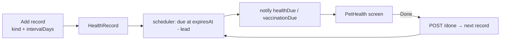

# Health reminders — widen `HealthRecord` into the recurring hook

Status: **built and verified** (2026-09-10) - backend 45/45, app suites 40/40,
lint/types/colours clean. First of three; see
[arizona-launch.plan.md](arizona-launch.plan.md) and
[insurance-slot.plan.md](insurance-slot.plan.md).

## Goal

The vaccination record shipped as the app's first recurring, non-social reason
to open. Flea/tick and heartworm doses are the reminders owners actually forget
(monthly, and PetDesk's most-cited ones), and a vet visit or a medication is
the same shape. Same model, more kinds, one new field, and a "done" action that
re-arms the next reminder - the habit loop.

Decisions taken (with you, 2026-09-10): all four kinds; **interval model** that
re-arms on "done"; medications store a **name and a next-due date only, never a
dose**.

## Architecture

| Option | Verdict |
| --- | --- |
| Widen `HealthRecord` with `kind`s + `intervalDays` + `label` | **Chosen.** Same reads, same scoping, same reminder job. |
| A second `Reminder` model | No - two homes for "a dated thing about a pet", and the status/reminder code exists once already. |

- **Kinds gain a category.** `services/vaccinations.js` keeps owning the
  vaccination *status*; a sibling table `KIND_CATEGORIES` maps every kind to
  `vaccine | prevention | visit | medication`. `statusOf()` filters to vaccine
  kinds first, so a pet with only a flea record is still `unknown`, not
  `partial`. The deck chip is unchanged.
- **`intervalDays`** (optional, 1–730). Set on prevention/medication kinds.
  `POST /:petId/health/:recordId/done` writes the *next* record (same kind,
  label, interval; `administeredAt` = now, `expiresAt` = now + interval) and
  schedules its reminder; 400 on a record without an interval. The old record
  stays - it is history.
- **`label`** (optional, ≤60) - the medication's name, shown as the row title
  for `medication`/`other`. No dose field exists on purpose.
- **A second notification type, `healthDue`** ("A reminder for your pet"),
  for non-vaccine kinds; `vaccinationDue` keeps its wording. Both route to
  `PetHealth` with `petId` and sit under `playdateReminders`.



## Todos

| # | Task | Status |
| --- | --- | --- |
| 1 | `vaccinations.js`: `KINDS` += `fleaTick`, `heartworm`, `vetVisit`, `medication`; `KIND_CATEGORIES`; `VACCINE_KINDS`; `statusOf` filters to vaccines; `nextFrom(record, now)` pure helper | todo |
| 2 | `HealthRecord`: `intervalDays`, `label`; pre-validate: medication requires `label` | todo |
| 3 | `HealthRecordController.markDone`; route `POST /:petId/health/:recordId/done` (static-before-param order kept); reminder handler picks `healthDue` for non-vaccines and uses `label` | todo |
| 4 | `notificationTypes.js` + app mirror: `healthDue` | todo |
| 5 | `api.ts`: kinds union, `intervalDays?`, `label?` | todo |
| 6 | App `api/health.js`: `markDone`, `KIND_CATEGORIES`, `CATEGORY_LABELS`, default intervals (fleaTick 30, heartworm 30) | todo |
| 7 | `PetHealthScreen`: group rows by category; interval field + label field appear by category; "Log today's dose" on interval rows; title "Health" | todo |
| 8 | Tests: `vaccinations.test.js` (status ignores non-vaccine kinds; `nextFrom`), `healthRecords.test.js` (done creates next + schedules; done on no-interval = 400; medication without label = 400; stranger cannot mark done), `PetHealthScreen.test.js` (interval field, done button posts) | todo |

## Copy rules

"Log today's dose" logs a *date*. Nothing suggests an interval as advice - the
30-day defaults are pre-filled numbers the owner can change, labelled "as your
vet prescribed". Medication rows show a name and a date; there is no field for
how much.

## Test plan

```bash
cd backend && npm run lint && npm run check:schemas && npm run check:auth && node --test test/vaccinations.test.js test/healthRecords.test.js test/types.test.js test/contract.test.js
cd PetPalsConnectApp && npm run lint && npm run typecheck && npm run check:colours && npx jest src/screens/pets/PetHealthScreen.test.js src/components/VaccinationBadge.test.js
```

## Risks

- **Reminder duplication on repeated "done"** - each done creates one record
  and one job; a double-tap makes two. Guard: the button disables while the
  request is in flight (same as save). Ponytail: no server-side dedupe.
- **`other` kind** already existed as a vaccine; it stays under `vaccine`.
