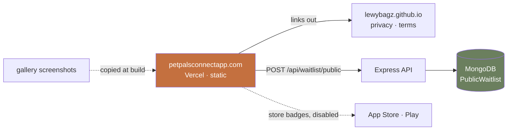

# The marketing site

## What this is

A public site at **petpalsconnectapp.com**, on Vercel, in the faceted low-poly
clay style of the supplied reference art. Playdates lead; the care hub is the
"and it works from day one" answer. Its job is the Arizona waitlist now and
installs when the stores are live.

It is a **fourth package** in a repo that currently has three, and it is the
first thing in this codebase written for people who are not users yet.

---

## The three findings that shaped this

**1. The in-app waitlist cannot be reused, at all.**
`POST /api/waitlist` is mounted behind `authenticate`, reads `req.userId`, and
`Waitlist.user` is a `required`, `unique` ref to a `User`
([Waitlist.js:14](backend/models/Waitlist.js#L14)). It exists for somebody who
already installed the app, signed up, and hit the fence. A website visitor has
none of that. This needs a genuinely separate path — Phase 2 below.

**2. The launch fence is the whole state, not six cities.**
`LAUNCH_REGIONS = ["AZ"]` and `PREFIXES.AZ` covers 850-865 with gaps
([regions.js](backend/services/regions.js)). The six-city list in
`services/destinations.js` is only where the *places directory* is seeded.
"PetPals is open across Arizona" is true; "in Phoenix and Tucson" undersells it.

**3. The palette conflict is real and is resolved in the site's favour.**
The app is cool — `primary: #2563EB` on `#F8F9FB`
([tokens.ts:88](PetPalsConnectApp/src/styles/tokens.ts#L88)). The art is warm
terracotta, sage and cream. Per the decision: the **site is warm**, and
screenshots live inside faceted clay phone frames so the app's blue reads as
*the product* sitting in a warm world — which is what the reference image with
the phone already does. The app is not retheming.

---

## Architecture decision

### A static Vite site, not Next.js

| Option | Verdict |
| --- | --- |
| **Vite + vanilla TS** | **Chosen.** The page is content, images and one form. No SSR need, no routing framework need (a handful of pages is a handful of HTML entries), no React needed for a page with one piece of interactive state. Ships as static files; Vercel serves them from the edge. |
| Next.js | Rejected. Brings a framework, a React dependency and a build server to render four static pages. Its real advantages — SSR, ISR, server actions — answer problems this page does not have. |
| Astro | The honest runner-up: content-first, islands, great defaults. Rejected on ladder rung 5 reasoning only — the site needs so little JS that the framework would be most of it. Revisit if the site grows a blog. |
| Plain HTML in `docs/` | Rejected by the hosting decision, but worth noting it was viable. |

**The one piece of JS that matters is the waitlist form.** Everything else is
CSS: scroll reveals via `animation-timeline: view()` with an
`IntersectionObserver` fallback, and `prefers-reduced-motion` honoured.

### Where it lives

`marketing/` at the repo root. A fourth `package.json`, which CLAUDE.md is
pointed about — the *last* root-level `package.json` was a stale dependency copy
with 43 advisories and got deleted. This one is different and must stay
different: it has a name, scripts, its own CI step, and **no dependency on the
app or the backend**. The same hard rule applies one package over: the
marketing site never imports from `PetPalsConnectApp/` or `backend/`.

Screenshots are **copied in at build time** by a script that reads
`PetPalsConnectApp/screenshots/`, not imported across the boundary. A file copy
is not an import, and the copy list is explicit so a renamed board fails the
build rather than silently shipping a stale picture.

### The legal pages do not move

`docs/privacy.html` and `docs/terms.html` stay exactly where they are.
`src/config/legal.ts` names them, both store listings cite them, and
`LegalPoliciesScreen` opens them. The marketing site **links to the GitHub Pages
URLs** rather than hosting copies — a second copy is a second document that
drifts, which is the reason the app stopped embedding them in the first place.



---

## Phase 1 — The site itself

**Structure: a landing page plus three sub-pages**, per the decision.

| Route | Job |
| --- | --- |
| `/` | Hero → what it is → playdates → care hub → Arizona + waitlist → safety → install |
| `/arizona` | Why one state, which ZIPs, what happens if you are outside, the waitlist |
| `/safety` | Blocking, reporting, approximate location, what other users can see |
| `/care` | The hub: vets, reminders, records, the poison lookup |

Sub-pages exist because each answers a question somebody arrives with, and each
is linkable from a store listing or a reply. `/` is the narrative; they are the
detail.

### Design system

```
--cream:     #F5EFE3   page ground
--clay:      #C4703F   terracotta, CTAs and accents
--sage:      #6B7F5E   secondary, care-hub sections
--ink:       #2E2620   warm near-black, body text
--ink-muted: #6B6158
--surface:   #FFF9F0   cards
```

Every pairing gets a contrast check before it ships — the app holds itself to
WCAG AA in `tokens.test.js` and the site does not get to be sloppier because
nobody wrote a test. `--clay` on `--cream` needs verifying for body text
specifically; if it fails it is an accent only, never copy.

**Type: Nunito for display, matching the app** (`fonts.js` already loads
`Nunito_800ExtraBold` for its display role), self-hosted via `@fontsource`
rather than Google Fonts — a font request is a third-party request in the
privacy policy. Body copy on a system stack, which is what the app does.

**Voice: warmer and more playful**, per the decision. The art is toy-like and
the copy should enjoy that. Two guardrails, because they are product rules
rather than taste:

- **No claim the app cannot keep.** "Arizona only, for now" is charming when
  said plainly and dishonest when hidden.
- **Never call the collar a safety device, and never say the app finds a lost
  pet.** That phrasing is excluded from the app by `ShopScreen.test.js`; a
  marketing page is exactly where it would creep back in.

### Screenshots in clay frames

Four real ones, in both themes, from the gallery output:
`discover-card`, `care-hub`, `first-run`, and a match. They sit in an SVG/CSS
faceted phone frame so they belong to the illustration world.

`marketing/scripts/screens.mjs` copies them by an explicit list. A missing name
fails the build — a landing page showing a screen the app no longer has is the
same class of lie as a stale legal document.

---

## Phase 2 — The public waitlist

The one piece of backend work, and the one new public write surface.

- **`backend/models/PublicWaitlist.js`** — `email` (lowercased, unique), `zip`,
  `region` (derived through `regionForZip`, not taken from the body, exactly as
  `WaitlistController.join` derives it from the profile), `source`, `createdDate`.
  Deliberately **not** a `User` ref: the whole point is that there is no account.
- **`POST /api/waitlist/public`** — mounted **outside `authenticate`**, beside
  the two webhook routes that already are. This is a documented exception to
  CLAUDE.md's "every route is mounted behind `authenticate`" rule and the reason
  goes in a comment at the mount site, the way the webhook mounts already
  explain themselves.
- **Rate limited by IP** through `ipKeyGenerator` — `byUserOrIp` falls back to
  the address when there is no `req.userId`, which is the right unit here since
  the abuse is a script filling the table. A tight limit: this is one form
  submission per person, not an API.
- **Validation is the server's job.** Email format, ZIP shape via `isValidZip`,
  and `sanitize` already strips `$`-prefixed keys. Upsert on email so submitting
  twice is idempotent, like the in-app join.
- **`CORS_ORIGINS` must include `https://petpalsconnectapp.com`.** Currently
  `env.corsOrigins.length > 0 ? env.corsOrigins : true` — so with nothing set it
  reflects any origin and *works in development*, then fails in production the
  moment the variable is set. That is the worst failure shape there is, and it
  goes in `.env.example` with a comment.
- **Retention and deletion.** `retention.js` gets a window, `docs/privacy.html`
  gets a row describing what the site collects and why. An email address given
  by somebody who is not a user is still personal data, and the policy currently
  describes only the in-app path.

An unsubscribe/removal path is **not** built in v1: the list is "tell me once
when it opens", every mail will carry a removal link, and until there is a
sending mechanism there is nothing to unsubscribe from. `ponytail:` noted in
the model.

---

## Phase 3 — Ship it

- `vercel.json` — static build, security headers (CSP, `X-Content-Type-Options`,
  `Referrer-Policy`), and a redirect from the bare domain to `www` or vice versa.
- **Re-enable the Vercel plugin.** `.claude/settings.local.json` currently has
  `"vercel@claude-plugins-official": false` — it was trimmed as unused, and this
  is the task that needs it back.
- **`.github/workflows/ci.yml` gets a marketing job**: install, lint, build,
  and run the screenshot-copy script so a renamed board fails CI rather than
  production.
- Open Graph and Twitter cards, with a dedicated 1200×630 image from the art set.
- `robots.txt`, a real `sitemap.xml` for four routes, and a favicon from the art.
- Lighthouse ≥ 95 on performance and accessibility. Images as AVIF/WebP with
  explicit dimensions, so there is no layout shift on the hero.

---

## The art you need to supply

Same style as the three references: faceted low-poly, matte clay and wood,
warm cream ground, soft studio light, shallow depth of field, slight top-down
three-quarter view for scenes.

**Important: do not reproduce the first reference's phone screen.** It shows a
fabricated "PET SEARCH CHAT / AdoptBot" adoption UI, which is not this product —
PetPals is playdates for dogs people already own, and there is no AdoptBot.
Where a phone appears, its screen is either blank/abstract or a real screenshot
composited in. The *style* of that image is right; the content is not.

| # | Piece | Ratio | Where | Notes |
| --- | --- | --- | --- | --- |
| 1 | **Hero: two dogs meeting** — different breeds and sizes, on a small faceted grass plinth, mid-greeting | 4:3 | `/` hero | The product in one image. Two dogs, not one — this is the thing the app is for. |
| 2 | **The dog alone** — the supplied Buddy piece already works | 1:1 | `/` playdates section | Reuse as-is. A collar tag is good; leave it generic. |
| 3 | **The park scene** — the supplied isometric park already works | 1:1 | `/` playdates or `/arizona` | Reuse as-is. Perfect for "somewhere to meet". |
| 4 | **Care hub still life** — a food bowl, a small vet cross, a leash, a folded blanket, arranged on a wooden shelf | 3:2 | `/` care section, `/care` hero | No pills, no syringes, no medical instruments — the app describes guidance and never prescribes. |
| 5 | **Arizona** — a faceted desert plinth: saguaro, low red rock, a map pin like the park image's | 4:3 | `/` Arizona section, `/arizona` hero | The launch-fence story, and the most distinctive section on the page. |
| 6 | **Safety** — a shield or a small closed gate in clay, warm rather than corporate; or a dog behind a low garden fence | 1:1 | `/` safety, `/safety` hero | Must not read as surveillance or security-product. |
| 7 | **Install** — a faceted phone on a wooden shelf, **screen blank or abstract**, a dog beside it | 16:9 | `/` install CTA, OG image | Screen stays empty; real screenshots are composited separately. |

Deliver as PNG with transparency where the subject is isolated (2, 4, 6),
otherwise on the cream ground. 2048px on the long edge; the build makes the
responsive sizes.

---

## Todos

| # | Todo | Status |
| --- | --- | --- |
| 1 | Scaffold `marketing/` (Vite + TS), the design tokens, Nunito self-hosted, and the base layout | pending |
| 2 | Add `PublicWaitlist` + `POST /api/waitlist/public` outside `authenticate`, IP-limited, with tests | pending |
| 3 | Wire `CORS_ORIGINS`, `.env.example` and the retention window; add the privacy-policy rows | pending |
| 4 | Build `/` — hero, playdates, care hub, Arizona + waitlist form, safety, install | pending |
| 5 | Build `/arizona`, `/safety`, `/care` | pending |
| 6 | Add `scripts/screens.mjs` (explicit copy list, fails on a missing board) and the clay phone frames | pending |
| 7 | `vercel.json`, OG images, robots/sitemap, security headers; re-enable the Vercel plugin | pending |
| 8 | Add the marketing job to CI; deploy and point the domain | pending |

Todo 2 can proceed in parallel with 1. Todo 4 is blocked on the art, though the
page can be built against placeholders and the images dropped in.

---

## Test plan

```bash
# Marketing: lint, typecheck, build, and the screenshot copy
cd marketing && npm run lint && npm run typecheck && npm run build

# Backend: the new endpoint, plus the audits that will judge it
cd backend && npm run lint && npm run check:schemas && npm run check:auth && npm test
```

New tests and what each gates:

- **`backend/test/publicWaitlist.test.js`** — an unauthenticated POST is
  accepted; `region` is derived from the ZIP and **ignored if sent in the body**;
  a duplicate email is idempotent rather than an error; a malformed email and a
  malformed ZIP are both 400; the rate limit bites.
- **`check:auth` will flag the new route** — it is an unauthenticated write and
  the audit is built to be suspicious of exactly that. It goes in the allowlist
  **with a reason**, the same way `PUBLIC_READS` entries do, or the audit is
  being talked out of its job.
- **`accountDeletion.test.js`** — `PublicWaitlist` has no `ref: "User"`, so the
  guard will *not* trip on it. Decide deliberately: an address given before
  signup is not owned by the account that later uses it, so it is **not**
  cascaded, and the retention window is what removes it.
- **Lighthouse** on the built site, and a manual pass at 400px — the app holds
  itself to a phone-width floor and the site should too.

**Manual smoke:** submit the form from the deployed origin (this is what CORS
gets wrong in production and right in development); submit the same email twice;
submit an Arizona ZIP and a non-Arizona ZIP and confirm both are recorded with
the right region; confirm every legal link resolves to the GitHub Pages copy.

---

## Risks and open questions

- **The store badges are disabled today.** Per the decision they render greyed
  with "coming soon". There is a real risk of forgetting to flip them: the
  listing URLs go in one config file and a comment names the flip as launch work.
- **A new unauthenticated write surface is the thing this repo has been most
  careful about.** The mitigations are a tight IP-keyed limit, server-side
  validation, `sanitize` already in the chain, and no read path at all — nothing
  can enumerate the list. Worth a second look before deploy.
- **Nothing sends email yet.** The waitlist collects addresses and there is no
  mechanism to mail them. That is honest for now — the row is the demand signal —
  but the page must not promise a speed of reply that does not exist. "We'll
  email you when it opens" is a commitment; keep it vague on timing.
- **`marketing/` is a fourth `package.json` in a repo that deleted its last
  root-level one** for being a stale, unaudited copy. It needs its own CI step
  and its own `npm audit` from day one, or it becomes the same problem.
- **The copy decision and the app's own voice differ slightly.** The app is
  plain and understated by rule; the site is warmer and more playful by choice.
  That is a deliberate register shift, not an inconsistency — but the *claims*
  must stay identical, and the excluded phrasings above are non-negotiable.
- **Open question: what happens when Arizona is no longer the only state?**
  `LAUNCH_REGIONS` is the one place the rule lives and the site hardcodes
  "Arizona" in copy and in a page route. Worth deciding now whether `/arizona`
  should be `/where-we-are` from the start.

---

## Skills for implementation

**Domain tags:** marketing site · frontend/visual design · copywriting · API
endpoint · privacy/compliance · deployment.

| Phase | Invoke |
| --- | --- |
| 1, 4, 5 | `frontend-design` — fires automatically on UI work. This is the skill's home ground: a distinctive landing page is exactly what it exists to stop being generic. |
| 4, 5 | `copywriting` — the whole page is product and marketing copy, and it is the deliverable most likely to drift into the "on distribution" voice the global instructions warn about. |
| 2 | `security-guidance` — runs on `Edit`/`Write`. A new unauthenticated public write is the highest-risk thing in this plan. |
| 7, 8 | `vercel` — **currently disabled** in `.claude/settings.local.json` and needs re-enabling for this work. |

No new installs needed. `design-taste-frontend`, `high-end-visual-design` and
`impeccable` are all installed and overlap heavily; `frontend-design` fires
automatically, so the others are worth invoking only if the first pass reads as
templated.

**Not consulted:** Context7 — Vite's API is not in question and nothing here
uses a library whose shape I would be guessing at.
