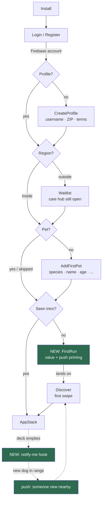

# Onboarding for retention

## What this is

An assessment of the current onboarding against cited industry research, and a
plan to rebuild it around the one thing it currently cannot do: be measured.

The verdict up front, because it is not the usual one. **The onboarding is
unusually well-built and it is not the problem.** The state machine is correct,
resumable and honest; the copy is human; the empty states are distinguished from
errors. What is missing is not polish. It is that (a) nothing measures it, (b)
the push permission — the single highest-leverage retention lever in the app —
is spent cold on launch, (c) nothing routes a finished user to the moment the
app is for, and (d) an Arizona user can exhaust the deck in an afternoon and has
no reason to open the app tomorrow.

Research says D30 for a matching-shaped app collapses to ~7%. Onboarding does
not fix that. What happens in the seven days *after* onboarding does, and three
of the four problems below live in that window.

---

## What the research actually says

Every number below is attributed. Where a widely-repeated claim turned out to be
unsourced, it is listed as folklore and **not** acted on — this plan follows
`content/research/standards.md`'s rule that a number gets a name attached.

### Benchmarks to hold ourselves to

| Metric | Figure | Source |
| --- | --- | --- |
| D1 / D7 / D30, all verticals | 26% / 13% / 7% | Adjust, *What makes a good app retention rate?*, Apr 2024 |
| D1, Social vertical | 29% | Adjust, 2024 |
| Dating D1 → D30 (curve shape) | 28.3% → 8.78% (Android) | AppsFlyer retention data |
| Install → signup, week one | 16% (ecommerce) / 21% (fintech) | CleverTap Benchmark Reports, 2019 / 2022 |
| Of users who sign up, share doing so within 75 seconds | 70% | CleverTap Fintech Benchmark, 2022 |
| Abandon over forced account creation | 18% | Baymard Institute, Sep 2025 |
| Push opt-in median, iOS | ~49% | Airship 2025 Benchmarks (9B users, 2024 data) |
| Push opt-in median, Android | 71.3% (2023) → 59.5% (2024) | Airship 2025 Benchmarks |
| Push opt-in, Lifestyle category | Android 38.8% / iOS 34.0% | OneSignal 2024 |
| In-app messaging to opted-out users | +14% opt-in | Airship 2025 Benchmarks |

Sources: https://www.adjust.com/blog/what-makes-a-good-retention-rate/ ·
https://www.appsflyer.com/glossary/retention-rate/ ·
https://clevertap.com/news/press-release/clevertaps-fintech-benchmark-report-only-1-in-5-users-that-install-fintech-apps-sign-up-within-week-one/ ·
https://baymard.com/lists/cart-abandonment-rate ·
https://growth.airship.com/rs/313-QPJ-195/images/Airship-2025-Push-Notification-Benchmarks-EN.pdf ·
https://onesignal.com/mobile-app-benchmarks-2024

### The two findings that changed this plan

**1. "Don't ask for registration up front" is contradicted by the only RCT on
the question.** *Not Registered? Please Sign-up First: A Randomized Field
Experiment on the Ex-ante Registration Request* (Information Systems Research,
~37,127 users) found asking for registration **up front** produced +58.08%
registration, +13.22% long-run revenue, and **no significant short-term
conversion loss**. The anti-registration consensus is qualitative (NN/g usability
sessions) and about ecommerce checkout, where the goal can be completed
anonymously. Here the account *is* the product.
http://faculty.marshall.usc.edu/jinchi-lv/publications/ISR-HMSLG21.pdf

Consequence: **the current signup-first architecture is right and is not
changed.** Guest mode is out of scope — the user's own answer is that a marketing
site will carry the pre-auth "see what you'd get" job, which is the correct place
for it and keeps `authenticate` on every route, as CLAUDE.md requires.

**2. The empty-network strategy already in this repo is the textbook one.**
Andrew Chen's *The Cold Start Problem* (2021): build an **atomic network** (one
dense place, not thin coverage everywhere) and **"come for the tool, stay for the
network"** (single-user value that works before the network is populated). The
Arizona launch fence is the first; the care hub is the second. Both are already
built. Nothing in this plan contradicts them; Phase 4 leans on them harder.
https://a16z.com/books/the-cold-start-problem/

### Folklore — named so it is not acted on

- **Facebook's "7 friends in 10 days"** — a 2012 conference anecdote, no dataset
  ever published. Mode's analysis calls it "a memorable average computed across a
  diverse set of people". Use the *method* (compare retained vs churned cohorts),
  never the number.
- **"Completion drops 4-6% per field beyond the eighth"** — untraceable to any
  study. Baymard's actual finding is that **field count matters more than step
  count**, which is a different and more useful claim.
- **Specific push-priming multipliers ("2-3x", "30-50% higher")** — appear only
  in vendor SEO pages, none linking to a test. The Localytics priming study is
  genuine industry lore but its source page is gone. Priming is justified here by
  a *documented platform fact*, not a statistic: **on iOS the system prompt fires
  once, permanently.** That alone is sufficient.
- **Pet-app market CAGR reports** — report-mill figures disagreeing by 3x.
  Excluded. The two solid pet numbers: Rover's FY2022 10-K (60% of the Jan 2022
  cohort rebooked within 12 months) and APPA's $158B / 95M US pet households
  (2024-25). Neither is social-app retention; **no credible public data on pet
  *social* app retention exists.** We will have to generate our own — which is
  Phase 1.

---

## Assessment of what exists

### What is genuinely good — do not "improve" these

- **[AuthSessionContext.js](PetPalsConnectApp/src/context/AuthSessionContext.js)** —
  onboarding as resumable session states (`signedOut → needsProfile → needsPet →
  ready`) rather than a screen that runs once. Three non-atomic writes with an
  interruption-safe resume at each boundary. This is the correct architecture and
  it is load-bearing for Phases 2-4.
- **Skip is remembered per user** (`skipKey`), so a skip is not a slower wall.
- **[OnboardingProgress.js](PetPalsConnectApp/src/components/ui/OnboardingProgress.js)** —
  three dots and a count, with `accessibilityRole="progressbar"`. Correct.
- **Species-aware form** — [species.js](PetPalsConnectApp/src/data/species.js)
  declares `breeds`/`weighed`/`matchable` rather than branching per field, and a
  non-matchable species says so *before* finishing, not on an empty Discover tab.
  This is better than most shipped onboarding.
- **[location.js](PetPalsConnectApp/src/services/location.js)** — a real
  prominent-disclosure sheet, non-cancelable, asked once, never re-nagged. This is
  the pattern push should have copied.
- **[WaitlistScreen.js](PetPalsConnectApp/src/screens/auth/WaitlistScreen.js)** —
  out-of-region is a session state with a way through to the care hub, not a
  refusal. Textbook come-for-the-tool.

### The four problems

**P1 — The push permission is asked cold, on launch.**
[usePushNotifications.js](PetPalsConnectApp/src/hooks/usePushNotifications.js)
calls `requestPermission(instance)` inside an effect that fires the instant
`status === AuthStatus.ready`. There is no priming, no context, no "not now".
The user has just finished a form and is shown an OS dialog about notifications
for an app they have not used yet.

This is the sharpest inconsistency in the codebase: `useLocationSync` explicitly
refuses to do this — its comment says the prompt should appear "where the user
asked for something location-shaped … rather than in their face on launch" — and
`services/location.js` builds a whole disclosure sheet to honour that. Push got
neither. On iOS that prompt fires **once, permanently**; a "no" here is
unrecoverable in-app forever.

Against an iOS median of ~49% (Airship) and a Lifestyle-category figure of
34% iOS / 38.8% Android (OneSignal), a cold ask at the worst possible moment is
very likely under both. And push is how every re-engagement mechanism in Phase 4
reaches anyone.

**P2 — Nothing routes a finished user to the app's aha moment.**
"Finish setting up" flips the session to `ready` and `RootNavigator` swaps in
`AppStack`, which lands on Home. Home is shelves of *other people's* content —
latest pets, favourites (empty), an article. The walkthrough only auto-starts on
Home, More and Favourites. Nothing takes a brand-new user to Discover, which is
the one screen the entire product is about.

The defensible version of the aha-moment literature is Duolingo's, which is
first-party and attributable (Jorge Mazal, former CPO, Lenny's Newsletter, Feb
2023): leaderboards raised learning time 17%; streak work cut daily churn of
their best users by over 40%. The transferable lesson is not a number, it is that
they *identified the retaining behaviour and drove new users into it*. Ours is
plainly a first swipe, and probably a first match.
https://www.lennysnewsletter.com/p/how-duolingo-reignited-user-growth

**P3 — Nine fields across three screens, and some are avoidable.**
Account (email, password, confirm) → Profile (username, ZIP, terms) → Pet
(species, name, breed, age, weight, +optional photo). Baymard's finding is that
**field count matters more than step count** — so splitting differently is not
the fix; asking less is. Specific avoidable ones are listed in Phase 3. Note
CleverTap's 75-second figure: this decision is made fast, so every field that can
be deferred should be.

**P4 — The deck empties and nothing brings anyone back.**
Arizona-only launch means a real new user may swipe everyone reachable within
their `playdateRange` in one sitting and hit "That's everyone for now"
([DiscoverScreen.js:231](PetPalsConnectApp/src/screens/swipe/DiscoverScreen.js#L231)).
The empty state is honest and well-written, offers Refresh, and hints at sharing
location — but there is no hook: no "we'll tell you when someone new joins", no
reason to return tomorrow. D30 is exactly where dating-shaped apps fall to 7-8.8%
(AppsFlyer), and this is the mechanism by which it happens.

**P0 — underneath all four: nothing is measured.**
There is no analytics of any kind in the app. Not a provider, not an event, not a
funnel. Every number in the research table above is somebody else's; we have
none of our own. `ActivityLog` exists as a model and controller but **nothing
writes it**, it requires a signed-in `user` (so it cannot record pre-profile
steps), and it is the same dead-stub shape as `Service` and
`PotentialPlaydateLocation`, both of which this repo has already deleted.

Optimizing a funnel you cannot see is guessing. Phase 1 fixes this first, per the
user's decision.

---

## Architecture decision

### Analytics: a first-party event model, not a vendor SDK

**Chosen: a new `AnalyticsEvent` Mongo model + `POST /api/events`, written from
one app-side service.**

| Option | Verdict |
| --- | --- |
| PostHog / Amplitude SDK | Rejected. A new dependency, a new vendor in the privacy policy and retention table, a new SDK in the bundle, and device-level identifiers that turn an ATT/consent question into a shipping blocker. Generous free tiers, but the cost here is not money. |
| Firebase Analytics | Rejected, and this is the close call. `@react-native-firebase/*` is already installed, so it is ladder rung 5. But CLAUDE.md's hard rule is **"Firebase provides auth, push and file storage only"** and **"MongoDB is the single source of truth for app data"**. A funnel we query to make product decisions is app data. Taking this would put the one dataset that governs the roadmap in the one place the repo says data must not live. |
| Extend `ActivityLog` | Rejected. It `required`s a `user`, so it cannot record the `needsProfile` step — which is precisely the step with the highest drop-off. Its `actionDetails`/`actionType`/`creator` shape fits nothing here. It is dead code; Phase 1 deletes it rather than inheriting it. |
| **New `AnalyticsEvent` model** | **Chosen.** Mongo stays the source of truth. No new dependency. `firebaseUid` rather than a `User` ref, so pre-profile steps are recordable. Scoped, retained and deleted by machinery that already exists (`retention.js`, `accountDeletion.js`). |

The cost is that there is no dashboard — Phase 1 ships a small aggregation
endpoint instead, moderator-guarded. That is the deliberate corner, and it gets a
`ponytail:` comment.

### Everything else extends what is there

- Push priming reuses the **exact shape of `services/location.js`** — an
  explanation before the OS prompt, an affirmative tap, a "not now" that means no
  without the OS being asked, never shown twice. One more function in one more
  service, not a new pattern.
- The new session state (`needsIntro`) is **one more entry in an enum that
  already has eight**, picked by `RootNavigator` exactly like the others. This is
  the repo's established idiom for "onboarding is a sequence of states".
- Re-engagement reuses **`services/scheduler`** (register a handler, schedule a
  job) and **`notify()`** — both already carry health reminders. No queue, no new
  infrastructure.

### The flow



---

## Phase 1 — Measure it (do this first, merge alone)

Nothing else in this plan can be evaluated without it. Ship it, let it run, then
optimize against real numbers rather than Adjust's.

**Backend**

- `backend/models/AnalyticsEvent.js` — `firebaseUid` (String, indexed, **not** a
  `User` ref, so pre-profile events record), `userId` (optional ref, backfilled
  once known), `name` (String, enum from the table below), `props` (Mixed, small),
  `platform`, `appVersion`, `at` (Date, indexed). No IP, no device id — nothing
  that turns this into a tracking question.
- `backend/services/analytics/events.js` — **the one table of event names**, same
  idiom as `notificationTypes.js`, `reportStates.js` and `picks.js`. An event not
  in the table cannot be written. This is what stops the vocabulary drift that bit
  notifications (two `type` vocabularies) and settings (three shapes).
- `backend/controllers/AnalyticsController.js` + `backend/routes/events.js` —
  `POST /api/events` accepts a **batch**, validates every name against the table,
  drops unknown names rather than erroring (a client one version ahead must not
  500). Rate-limited per account in `middleware/rateLimits.js`. `GET /api/events/funnel`
  is moderator-guarded and goes in `GUARDED_READS` with a reason.
- `backend/services/retention.js` — add `AnalyticsEvent` with its own
  `ANALYTICS_RETENTION_DAYS` (90). Add to `accountDeletion.js`'s cascade, **not**
  `RETAINED` — a funnel event is not a tax record.
- **Delete `ActivityLog`** — model, controller, route, and its line in
  `accountDeletion.js`. Dead since it was written; `schemaAudit.test.js` already
  documents it as broken. Deleting it is the whole reason we are not extending it.

**App**

- `PetPalsConnectApp/src/services/analytics.js` — `track(name, props)`. Buffers to
  AsyncStorage via the existing `localCache`, flushes on a timer and on
  background. **Never throws and never blocks a UI path** — same rule as `notify()`'s
  push half. Fails silently offline; a dropped event is always better than a
  broken screen.
- Instrument the funnel — the minimum set that answers "where do they go?":
  `app_opened`, `signup_started`, `account_created`, `profile_started`,
  `profile_created`, `pet_started`, `pet_created`, `pet_skipped`,
  `onboarding_completed`, `first_swipe`, `first_match`, `push_primer_shown`,
  `push_permission_result`, `deck_emptied`.

**Privacy** — `docs/privacy.html` gets a row (what is collected, why, 90 days).
The retention table there is written from `RETAINED`; this is a cascade-deleted
model, so it is described in the collection section, not the retention table.

> `ponytail:` no dashboard — `GET /api/events/funnel` returns counts per step for
> a date range and that is read by hand. Add a real dashboard when the numbers
> are being looked at weekly rather than monthly.

**Skipped:** cohort analysis, retention curves, per-property breakdowns, a UI.
Add when the funnel counts are no longer enough to answer the next question.

---

## Phase 2 — Push priming and the first-run destination

The two highest-leverage fixes, and they belong in one screen.

- `PetPalsConnectApp/src/services/pushPermission.js` — copy the shape of
  `services/location.js` exactly: read the current status first, return early if
  already answered or `canAskAgain === false`, show the app's own explanation,
  only call `requestPermission` on an affirmative tap. Never asked twice.
- `PetPalsConnectApp/src/hooks/usePushNotifications.js` — **remove the
  `requestPermission` call from the mount effect.** The hook keeps doing token
  registration, foreground messages and tap routing; it registers a token only
  when permission is already granted. This is the actual bug fix, and it is a
  deletion.
- New `AuthStatus.needsIntro` + `introKey(profile)` in `AuthSessionContext`,
  remembered per user exactly like `skipKey` and `continueKey`. `statusForProfile`
  gains one branch, after the pet check and before `ready`.
- `PetPalsConnectApp/src/screens/auth/FirstRunScreen.js` registered on
  `RootNavigator` beside the other gates. Three short panels — what Discover is,
  what the care hub is, and *then* the push ask in context ("we'll tell you when
  someone wants to meet {pet}") — ending on a button that lands on **Discover**,
  not Home. A petless user (skipped) gets the care-hub panel and lands on More.
- `OnboardingProgress` is **not** shown here. Onboarding finished at the pet
  step; this is the app, and putting a progress bar on it would make it read as a
  fourth form.

Research basis: Apple's own documentation says people "may not have enough
information to make a decision, and might reject the authorization"
(https://developer.apple.com/documentation/usernotifications/asking-permission-to-use-notifications).
Airship measured +14% opt-in among already-opted-out users from in-app messaging,
which is the same mechanism one step later.

**Considered and deferred:** iOS **provisional authorization**
(`UNAuthorizationOptions.provisional`) — notifications deliver quietly with no
prompt at all, each carrying Keep/Turn Off. Genuinely attractive, and Apple
endorses requesting it at first launch. Deferred because it needs
`@react-native-firebase/messaging` configuration verified against a real device,
and there is no iOS device here. Revisit with the numbers Phase 1 produces.

---

## Phase 3 — Fewer fields

Baymard: field count, not step count. The step sequence stays (it is resumable and
correct); the questions get fewer.

- **Drop "confirm password"** on [RegisterScreen.js](PetPalsConnectApp/src/screens/auth/RegisterScreen.js).
  The field exists to catch a typo in a value the user cannot see — but the screen
  already has a working show/hide toggle, and a typo is fully recoverable via the
  password reset that `LoginScreen` already implements. One field, on the screen
  where abandonment is highest.
- **Default the username** on [CreateProfileScreen.js](PetPalsConnectApp/src/screens/auth/CreateProfileScreen.js).
  `suggested` is already computed from the Google display name or the email local
  part — but it is only a starting value the user must still confirm. Where it is
  available, check it against `useUsernameAvailability` on mount and, if free,
  treat the field as answered with an "edit" affordance rather than an empty
  required input.
- **Age: a stage, not a number.** `AddFirstPetScreen` asks for a decimal age and
  validates 0-40. `services/petCare/recommend.js` already derives a `lifeStage`
  from it, and `lifeStage` returns **null rather than guessing** for unknown.
  Offering Puppy / Adult / Senior with "enter exact age" behind it is one tap
  instead of a keyboard — and an adopted dog's owner often does not *know* the
  number, so the field currently forces a fabricated one into the matcher.
- **Keep ZIP, terms, weight and species.** ZIP is the launch fence and the only
  signal of *where* demand is. Terms are a legal requirement with a stored
  timestamp. Weight is what matching compares — CLAUDE.md: "a pet without it
  cannot be matched properly". Species decides the whole rest of the form.

That is roughly nine fields down to six, with two becoming taps.

> `ponytail:` the age control stores the midpoint of the chosen stage when the
> exact age is not given. Matching scores age difference, so a midpoint is a
> better input than a number somebody invented — revisit if scoring ever needs
> real precision.

---

## Phase 4 — A reason to come back

Where D30 is actually won. All of it reuses machinery that exists.

- **Notify me when someone new is nearby.** The `deck_emptied` state is the
  moment of highest intent — the user has just said "I want more of this". One
  button on the existing `EmptyState`. Server-side: a new `newPetNearby`
  notification type in `services/notificationTypes.js` (mirrored in
  `src/api/notifications.js`, checked by `types.test.js`), raised through
  `notify()` when a new matchable pet lands inside a waiting user's
  `playdateRange`. Reuses `reachableCandidates` for the range test so blocking,
  suspension and distance are not re-implemented — CLAUDE.md's rule that a second
  code path is a second place to forget one.
- **Finish your pet's profile.** `AddFirstPetScreen` deliberately defers
  temperament and favourite activities, and its own footnote promises they "help
  us find even better matches". Nothing ever asks again. A scheduled nudge 48h
  later via `services/scheduler` closes a loop the onboarding already opened —
  and it improves match quality, so it is not a nag for its own sake.
- **Care-hub reminders are the come-for-the-tool half, and they already exist.**
  `HealthRecord` reminders fire 30 days before `expiresAt` through the same
  scheduler. For an out-of-region or dog-less user these are the *only* reason the
  app opens, and Chen's framework says that is exactly right. Phase 4 adds no new
  mechanism here — it verifies the path is reachable from onboarding, which is
  the failure class this repo keeps finding.

Every push respects `wantsPush()` and quiet hours, unchanged.

**Explicitly not built:** streaks, gamification, daily-swipe limits, a leaderboard.
Duolingo's numbers are real but they are a *learning* product where a streak maps
to the behaviour being sold. A streak for meeting dogs invents an obligation the
product does not have, and `topics.md`'s instinct — do not manufacture urgency —
applies.

---

## Todos

| # | Todo | Status |
| --- | --- | --- |
| 1 | Add `AnalyticsEvent` model, `services/analytics/events.js` name table, `POST /api/events` batch route with rate limit, and moderator-guarded funnel read | pending |
| 2 | Delete `ActivityLog` (model, controller, route, deletion-cascade line); wire `AnalyticsEvent` into `retention.js` and `accountDeletion.js`; add the privacy-policy row | pending |
| 3 | Add `src/services/analytics.js` (buffered, never-throwing) and instrument the 14 funnel events | pending |
| 4 | Extract `services/pushPermission.js` on the `services/location.js` pattern and remove the cold `requestPermission` from `usePushNotifications` | pending |
| 5 | Add `AuthStatus.needsIntro` + per-user intro flag to `AuthSessionContext`; register `FirstRunScreen` on `RootNavigator`; land the user on Discover | pending |
| 6 | Reduce fields: drop confirm-password, auto-accept a free suggested username, replace exact age with a life-stage control | pending |
| 7 | Add `newPetNearby` notification type both sides + the notify-me button on Discover's empty state, raised through `notify()` via `reachableCandidates` | pending |
| 8 | Add the 48h "finish your pet's profile" scheduler job and handler | pending |

Todos 1-3 are Phase 1 and merge alone. 4-5 are Phase 2 and are the retention
fixes. 6 is independent and can land any time. 7-8 are Phase 4 and should wait
for Phase 1's numbers.

**This is more than one session.** Suggested split: PR 1 = todos 1-3, PR 2 =
todos 4-5, PR 3 = todo 6, PR 4 = todos 7-8.

---

## Test plan

Real commands from this repo's `package.json` and `.github/workflows/ci.yml`:

```bash
cd backend && npm run lint && npm run check:schemas && npm run check:auth && npm test
cd PetPalsConnectApp && npm run lint && npm run typecheck && npm run check:colours && npm test
cd PetPalsConnectApp && npm run gallery && npm run screenshots
npx expo export --platform android
```

New tests, and what each one is the gate for:

- `backend/test/analytics.test.js` — an event name outside the table is dropped,
  not written; the batch route is scoped to `req.userId`; the funnel read refuses
  a non-moderator. (The audit cannot see a handler that mutates a fetched doc —
  CLAUDE.md's own note on why `PUT /api/users/:id` was a hole.)
- `backend/test/accountDeletion.test.js` — already fails when a model with
  `ref: "User"` is in neither the cascade nor `RETAINED`. `AnalyticsEvent` uses
  `firebaseUid`, **not** a ref, so it will *not* trip that check — add it to the
  cascade explicitly and assert the deletion, or it silently outlives the account.
- `PetPalsConnectApp/src/services/pushPermission.test.js` — never prompts twice;
  "not now" does not reach the OS; an already-granted status short-circuits.
- `AddFirstPetScreen.test.js` — **does not exist today** and must, before touching
  the form. `AddPetScreen.test.js` asserts its payload against its form; this
  screen is the one every new user meets and has no such gate.
- `types.test.js` — will catch the `newPetNearby` type if the two tables
  disagree or its destination is not a registered screen. Free, already wired.
- `navigation.test.js` — will catch `FirstRunScreen`'s landing route.

**Manual smoke** (the parts no test covers):

1. Fresh install → register → profile → pet → confirm the push primer appears
   **in FirstRun**, not on launch, and that "Not now" never reaches the OS dialog.
2. Kill the app between each onboarding step and relaunch — confirm each resumes
   where it stopped. This is the property the whole state machine exists for.
3. Sign in with a cat-only account — confirm FirstRun offers the care hub and
   lands on More, not an empty Discover.
4. An out-of-region ZIP — confirm Waitlist still precedes the intro.

---

## Risks and open questions

- **`AuthSessionContext` is load-bearing and Phase 2 edits its state machine.**
  Eight states become nine, and `statusForProfile` gains a branch. Its ordering
  matters: suspended → waitlisted → pet → **intro** → ready. Put intro anywhere
  earlier and a suspended or waitlisted user gets an onboarding tour for an app
  they cannot use. `AuthSessionContext.test.js` exists and must cover the new
  ordering.
- **Analytics has a consent dimension I have not fully resolved.** First-party,
  no device identifiers, no third party, and tied to an account that agreed to the
  privacy policy — which is why this design was chosen over an SDK. But if an
  iOS reviewer reads `POST /api/events` as tracking, the answer is the privacy
  policy row and the absence of any cross-app identifier. Worth a look before
  submission. **Open question: do you want a settings toggle for it?** My
  recommendation is no — a toggle on first-party product analytics that carries no
  identifiers invites a question it then has to answer badly.
- **The funnel numbers will be small at first.** Arizona-only, pre-launch. Do not
  over-read a 40% drop-off across 12 users. Phase 4's triggers should wait for
  volume, which is the stated reason todos 7-8 come last.
- **`newPetNearby` is a push that can become spam.** One dense week in Phoenix and
  a waiting user gets one per new dog. It needs a cap (one per user per day, and
  only while the user has an empty deck) — that is a decision I would rather make
  against Phase 1's data than guess now.
- **Provisional push authorization is unverified.** Deferred in Phase 2 for the
  stated reason: no iOS device here, and CLAUDE.md's own rule is that a branch no
  test enters is only tested in production.
- **No credible public data on pet social app retention exists.** Everything in
  the benchmark table is from adjacent categories (social, dating, lifestyle). The
  dating curve is the closest analogue and is what Phase 4 is designed against —
  but it is an analogy, not a measurement, which is the strongest argument for
  Phase 1 going first.

---

## Skills for implementation

**Domain tags:** onboarding UX · mobile permissions · analytics/instrumentation ·
React Native · privacy/compliance · retention mechanics.

| Phase | Invoke |
| --- | --- |
| 2, 3 | `frontend-design` — auto-fires on UI work. FirstRunScreen is the one genuinely new screen; it must use `src/components/ui` (`Screen`, `Button`, `Text`) and tokens, or `check:colours` fails it. |
| 2, 3 | `copywriting` — the push primer and the FirstRun panels are the highest-stakes copy in the app. The primer has one shot on iOS. No technical jargon. |
| 1 | `security-guidance` — runs automatically on `Edit`/`Write`. `POST /api/events` is a new authenticated write surface. |
| all | `ponytail` — active. Phase 4 in particular is where speculative retention machinery would creep in. |

No installs performed. No gap found that warrants one — the onboarding-specific
work is UX and instrumentation, both covered.

**Not consulted, deliberately:** Context7 — no library API is in question; every
dependency this plan touches (`expo-location`, `@react-native-firebase/messaging`,
`mongoose`) is already used in the repo in exactly the shape needed, and the
in-repo call sites are better evidence than docs.

---

## Web research notes

All figures, sources and URLs are in **What the research actually says** above,
including the folklore section naming what was found to be unsourced and is
therefore not acted on. Three claims that would ordinarily shape a plan like this
— Facebook's "7 friends in 10 days", the "4-6% per field" rule, and the specific
push-priming multipliers — have no traceable primary source, and two appear to be
recent AI-generated SEO artifacts citing each other. They are excluded.

Two sources changed the plan's direction rather than decorating it: the ISR
randomized field experiment (which is why signup-first is kept) and Chen's
atomic-network framing (which is why the Arizona fence and care hub are treated as
assets to lean on rather than problems to solve).
