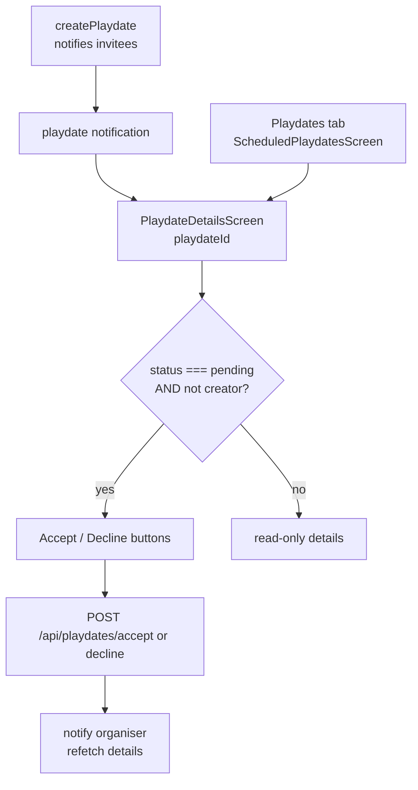

# Fix the reachability gaps, one by one

## Overview

Every CI gate is green (backend 514/514, app 555/555, lint, typecheck,
`check:schemas`, `check:auth`, `check:colours`). The defects that remain are
**reachability** gaps: endpoints that are built, guarded and tested, screens
that render correctly, and nothing that navigates between them. A screen
nothing navigates to passes every check in this repo.

This is the same class as commit `6dfe5fb` ("Wire up what was already built"),
and the fixes follow that precedent: connect the seams, don't rebuild the parts.

**Goal:** a playdate invitation can be accepted or declined; no reachable screen
crashes; the contract test can see the bug class that produced #5.

**Non-goals:** no new features, no redesign, no dependency changes, no schema
changes. `PlaydateModification` and `ChangePassword` stay orphaned for now
(open questions below).

## Architecture decision

Two options for playdate accept/decline:

| | Add actions to `PlaydateDetailsScreen` | Wire up `PlaydateRequestScreen` |
| --- | --- | --- |
| Fits existing patterns | **Yes** — notifications already land here | No — needs notification table repointed |
| Files touched | 1 screen + reuse existing API helpers | 1 screen + `src/api/notifications.js` + AppStack |
| Two places showing one playdate | No | Yes — `PlaydateDetails` and `PlaydateRequest` diverge |
| Risk | Low | Medium — the invite path and the tab path disagree |

**Chosen: extend `PlaydateDetailsScreen`.** Both the `playdate` notification
([notifications.js:31](../../PetPalsConnectApp/src/api/notifications.js#L31))
and the Playdates tab
([ScheduledPlaydatesScreen.js:46](../../PetPalsConnectApp/src/screens/bottomTab/ScheduledPlaydatesScreen.js#L46))
already navigate there. `Playdate.status` is a real enum
(`pending|accepted|declined|completed|cancelled`,
[Playdate.js:33](../../backend/models/Playdate.js#L33)), so the screen can tell
an invite from a confirmed plan without a new field. `acceptPlaydate` and
`declinePlaydate` already exist in
[playdates.js:103-111](../../PetPalsConnectApp/src/api/playdates.js#L103-L111)
— today they are called only by tests.

`PlaydateRequestScreen` then has no reason to exist and is deleted, the way the
three-screen playdate flow was deleted rather than repaired (CLAUDE.md,
"SchedulePlaydateScreen is the only way to arrange one").



## Implementation steps

Ordered so each phase is independently mergeable and the riskiest-but-highest-value
work lands first.

### Phase 1 — Playdate accept/decline (the blocking gap)

[PlaydateDetailsScreen.js](../../PetPalsConnectApp/src/screens/playdate/PlaydateDetailsScreen.js)
is 89 read-only lines and needs four fixes at once, because three of them are
crashes on the same screen:

1. **Add the actions.** Import `acceptPlaydate`/`declinePlaydate` from
   `src/api/playdates`. Show the pair only when
   `playdateDetails.status === "pending"` and the viewer is not the creator —
   the server enforces "only an invitee, once"
   ([PlaydateController.js:81](../../backend/controllers/PlaydateController.js#L81));
   the UI just must not offer an action that will 403. Use `Button` from
   `src/components/ui` (44pt floor), `useToast()` for the result — accepting is
   not destructive, so no `Alert` (CLAUDE.md: fourteen Alerts left, all offering
   a way out). Refetch on success so the buttons disappear.
2. **Guard `location`.** [Line 59](../../PetPalsConnectApp/src/screens/playdate/PlaydateDetailsScreen.js#L59)
   reads `playdateDetails.location.name`, but `getPlaydateById` deliberately
   sets `location = null` when the creator has location sharing off
   ([PlaydateController.js:51-53](../../backend/controllers/PlaydateController.js#L51-L53)).
   That is a guaranteed crash for exactly the privacy-conscious user the server
   is protecting. Render a "Location hidden" line instead.
3. **Populate `reviews`.** The screen maps `playdateDetails.reviews` into
   `ReviewComponent`, which reads `.rating`, `.comment` and `.date` — but
   `getPlaydateById` does not `.populate("reviews")`, so those are raw
   ObjectIds: no stars and "Invalid Date". Add the populate server-side.
4. **Fix the creator projection.** `.populate("creator", "name locationSharingEnabled")`
   selects `name`, which `User` does not have — it is `username`
   ([User.js:171](../../backend/models/User.js#L171)). Harmless today (nothing
   renders it) but it is the PascalCase-field trap one field over, and needed
   once the screen distinguishes the creator.

Then delete `PlaydateRequestScreen.js` and its `AppStack` registration.

### Phase 2 — `MyPlaydatesScreen` crash

[MyPlaydatesScreen.js](../../PetPalsConnectApp/src/screens/playdate/MyPlaydatesScreen.js)
is reachable (the `playdateCancelled` notification routes to `MyPlaydates`) and
crashes for every user with no playdates:

- **Line 5**: `Text` is imported from `@react-navigation/material-top-tabs`,
  which does not export it (verified against the installed package's typings —
  it exports only the navigator, tab bar, view and `useTabAnimation`). It is
  rendered at line 78 behind `playdates.length === 0`. Import `Text` from
  `react-native` — or better, `src/components/ui`, which caps Dynamic Type and
  names a colour.
- **Undefined styles**: `emptyMessage`, `tabIndicator` and `tabLabel` are
  referenced; only `list` is defined. Define them via `makeStyles(tokens)` +
  `useMemo`, the pattern CLAUDE.md documents for themed StyleSheets.
- **Missing `navigation`**: `<Tab.Screen>{() => <PlaydateList type="upcoming" />}</Tab.Screen>`
  passes no `navigation`, so `renderPlaydate`'s tap throws. Take it from
  `useNavigation()` inside `PlaydateList`.
- **`"#yourColor"`** at line 89 is an invalid literal that `check:colours`
  cannot see (its `HEX` regex requires `[0-9a-fA-F]`). Replace with a token.
  Consider `EmptyState` from `src/components/ui` instead of a bare `Text`.

### Phase 3 — Group chat creation dead end

[MoreScreen.js:66](../../PetPalsConnectApp/src/screens/bottomTab/MoreScreen.js#L66)
navigates to `GroupChatCreation` with **no params**, so `selectedPets` is `[]`
and the guard at
[GroupChatCreationScreen.js:52](../../PetPalsConnectApp/src/screens/chat/GroupChatCreationScreen.js#L52)
refuses with "Choose at least one pet to start a group with" — on a screen that
offers no way to choose one. The picker exists and works
([PetSelectionScreen.js](../../PetPalsConnectApp/src/screens/chat/PetSelectionScreen.js),
already registered behind `withRequiredPet`) but nothing navigates to it.

Point More's tile at `PetSelection`, which already navigates onward to
`GroupChatCreation` with `selectedPets`. One-line `route` change in the tile
table; both screens stay as they are.

Two consequences to accept deliberately, both arguably correct:

- `PetSelection` is registered as `PetSelectionWithPet`
  ([AppStack.js:100](../../PetPalsConnectApp/src/screens/navigation/AppStack.js#L100)),
  gated `species: "dog"` with the copy "Chats in PetPals happen between dogs".
  So a cat-only owner now gets that prompt instead of a screen that refuses at
  the last step — better, and consistent with CLAUDE.md's `hasPet` ≠ `hasDog`
  rule.
- It lists **friends'** pets, so a user with no friends yet sees an empty
  picker. That is honest (a group chat needs someone to be in it) but worth
  confirming the empty state reads well rather than looking broken — CLAUDE.md's
  "Empty is not the same as broken".

### Phase 4 — `UsersPetsScreen`

[UsersPetsScreen.js:16](../../PetPalsConnectApp/src/screens/profile/UsersPetsScreen.js#L16)
is `const UsersPetsScreen = (navigation) => {` — the props object bound as
`navigation`, so every tap calls `navigation.navigate` on `{navigation, route}`.
It also passes `currentUser.uid` (a Firebase uid) to `/api/users/pets/:userId`,
which happens to be harmless only because `getUserPets` ignores the param and
uses `req.userId`
([UserController.js:133](../../backend/controllers/UserController.js#L133)).

This screen duplicates `PetListScreen` and is reached from nowhere.
**Recommend deleting it** (see open questions). If kept: fix the destructure,
drop the manual `Authorization` header (CLAUDE.md — `src/api/axios` attaches the
token), and call `/api/users/pets/me`-style scoping rather than passing a uid.

### Phase 5 — `/api/playdates/past` and the contract-test hole

[PlaydateHistoryScreen.js:29](../../PetPalsConnectApp/src/screens/playdate/PlaydateHistoryScreen.js#L29)
calls `GET /api/playdates/past`, which no route declares. It falls through to
`GET /:id`, and `guardObjectIdParams` rejects `"past"` as a malformed ObjectId
→ **404**, so the screen shows its error state forever.

Two halves, and the second matters more:

1. **The call.** Either add `router.get("/past", ...)` before `/:id` (CLAUDE.md:
   "Declare static route paths before parameterised ones") mirroring
   `getUpcomingPlaydates`, or point the screen at an existing route. Since
   `PlaydateHistory` is itself unreachable, prefer deciding its fate first
   (open questions) — if it is wired up, add `/past`; if deleted, this
   disappears with it.
2. **The hole.** `matchesRoute` in
   [contract.test.js:91](../../backend/test/contract.test.js#L91) lets a
   `:param` route segment absorb a **literal** call segment, so this typo
   passed the one test built to catch "compiles fine, 404s at runtime". The
   test already strips query strings to avoid exactly this absorption; the same
   rule should apply to ordinary literals: a literal call segment may only
   match a literal route segment. I swept all 101 app calls against all 168
   served routes — `/api/playdates/past` is the only current instance, so
   tightening it is cheap and low-risk. **Do this even if the screen is deleted**
   — it is the gate that failed.

### Phase 6 — Cosmetic (optional, batch last)

Undefined styles that render unstyled rather than crashing (RN ignores an
`undefined` style): `styles.option`/`cancelOption`
([ChatCardComponent.js:179](../../PetPalsConnectApp/src/components/ChatCardComponent.js#L179)),
`styles.swipeAction` (`MessageItemComponent`), `styles.subscribeButton`
(`MatchingAlgorithmPopupComponent`). One matters more than cosmetics:
`styles.errorText` in
[UpcomingPlaydateScreen.js:71](../../PetPalsConnectApp/src/screens/playdate/UpcomingPlaydateScreen.js#L71)
is undefined, so the error text names no colour and inherits RN's black —
invisible on the dark surface. That is the exact failure `check:colours` exists
to stop, and it slips through because the ban inspects *defined* styles only.

Also dead code, safe to delete: `acceptFriendRequest`, `declineFriendRequest`,
`removeFavorite`, `cancelPlaydate`, `fetchMyPlaydates`, `describePlaydateStatus`,
`fetchRecentArticle`, `fetchMyReports` in `src/api/` — no non-test callers; the
screens use raw `api.` calls instead. (`acceptPlaydate`/`declinePlaydate` are
**not** in this list — Phase 1 makes them live.)

## Todo list

All done. Outcomes, where they differed from the plan:

| id | content | status |
| --- | --- | --- |
| 1 | Accept/decline on `PlaydateDetailsScreen`; null `location` guarded; `reviews` populated; creator projection fixed; `PlaydateRequestScreen` deleted | **done** |
| 2 | `MyPlaydatesScreen`: `Text` import, three undefined styles, missing `navigation`, `#yourColor` | **done** |
| 3 | More's group-chat tile points at `PetSelection` | **done** |
| 4 | `UsersPetsScreen` **fixed and wired**, not deleted - see below | **done** |
| 5 | `matchesRoute` tightened; failing test written first | **done** |
| 6 | `GET /api/playdates/past` added, static-before-parameterised | **done** |
| 7 | Cosmetic styles, incl. `errorText` and two token misuses found en route | **done** |

### Where the plan was wrong

**Todo 4 reversed.** The plan said delete `UsersPetsScreen` as a broken
duplicate of `PetListScreen`. It is not a duplicate: `PetListScreen` fetches
`/api/pets`, every *browsable* pet in the app. Profile's "Manage my pets"
button pointed there - so it opened a directory of strangers' dogs with a
delete button beside each. `UsersPetsScreen` is the screen that button always
wanted. Fixed (`({ navigation })`, the shared API client instead of hand-rolled
`Authorization` headers, a destructive-action `Alert`, an empty state) and
wired to Profile.

**`ChangePasswordScreen` deleted, and the open question was moot.** The plan
asked whether to add reauthentication or delete. Neither: `SecuritySettingsScreen`
already does password change *correctly* - reauthenticate first, provider
detection so a Google-only account is told rather than shown a form that can
only fail, strength scoring, and a reset-email fallback - and it is reachable
from Settings -> Security. `ChangePasswordScreen` was a superseded duplicate
that collected a current password and threw it away. Deleted.

### Found while fixing, not in the plan

- `getPlaydateById` nulls `location` for a privacy-conscious organiser and the
  screen read `.name` off it: a guaranteed crash for exactly the person the
  server was protecting. Now covered by a test.
- `.populate("creator", "name")` in **three** more places (`getUserPlaydates`,
  `getUpcomingPlaydates`, `MessageController.getMessageById`) - `User` has no
  `name`, it is `username`.
- `GET /api/users/pets/:userId` ignores its parameter and scopes to
  `req.userId`, so a URL naming somebody else returned your own pets. A static
  `GET /api/users/pets` now says what it actually does; the old form stays for
  compatibility.
- `MatchingAlgorithmPopupComponent` set `color: t.surface` on a label sitting on
  a `t.primary` button - the background token, not `onPrimary`. They coincide in
  light and diverge in dark.
- `MessageItemComponent`'s swipe actions had no background behind an
  `onPrimary` icon: invisible, and no tap target.

## Env vars / setup

None. No schema changes, no new dependencies, no dashboard configuration.

## Test plan

Existing suites cover the code being touched; the additions below are the new
checks each phase needs. Commands are this repo's own (CLAUDE.md "Verifying a
change", matching `.github/workflows/ci.yml`):

```bash
cd backend && npm run lint && npm run check:schemas && npm run check:auth && npm test
cd PetPalsConnectApp && npm run lint && npm run typecheck && npm run check:colours && npm test
cd PetPalsConnectApp && npm run gallery && npm run screenshots
```

New tests, per the repo's "new logic gets a test" rule:

- **Phase 1** — a screen test alongside
  [SchedulePlaydateScreen.test.js](../../PetPalsConnectApp/src/screens/playdate/SchedulePlaydateScreen.test.js):
  buttons show for a `pending` invitee, hidden for the creator and for
  `accepted`; a null `location` renders without throwing. Backend accept/decline
  behaviour is already covered.
- **Phase 2** — render `MyPlaydatesScreen` with an empty list; today that throws.
- **Phase 5** — a `matchesRoute` unit case: `GET /api/playdates/past` must not
  match `GET /api/playdates/:id`, while `GET /api/playdates/:param` still does.
- **Phase 3/4** — covered by
  [navigation.test.js](../../PetPalsConnectApp/src/screens/navigation/navigation.test.js),
  which checks every `navigate()` target exists and gets the param it reads.

Manual smoke (needs a device build — `npx expo run:android`): create a playdate
between two accounts, confirm the invitee's notification opens
`PlaydateDetails` with Accept/Decline, accept, and confirm the organiser is
notified and the buttons disappear.

**Worth adding to CI** (not in v1, but it is the gate that would have caught
most of this): a check that every screen registered in `AppStack` is either
navigated to, listed in a route table, or named in the notification
destinations. That single check covers findings 1, 3 and 4 at once.

## Risks & open questions

1. **Delete or wire the remaining orphans?** My recommendation, one line each:
   - `UsersPetsScreen` — **delete**; broken and duplicates `PetListScreen`.
   - `PlaydateHistoryScreen` — **wire** (add `/past`); "past playdates" is a
     real feature and `PostPlaydateReview` depends on that history existing.
   - `PlaydateModificationScreen` + its confirmation — **wire** from
     `PlaydateDetails`; the backend `PATCH /:playdateId/update` is built and
     guarded. Could be a Phase 8.
   - `ChangePasswordScreen` — **your call.** CLAUDE.md says the backend's
     `changeUserPassword` returns 410 by design and clients call Firebase's
     `updatePassword()` — which this screen does correctly. But it collects
     `currentPassword` and never uses it, so `updatePassword` will throw
     `auth/requires-recent-login` for most users. Wiring it up means adding
     reauthentication; deleting it means no in-app password change.
2. **`PlaydateDetails` shows `notes` and reviews to any participant** — that is
   existing behaviour, unchanged here, but worth a look given the repo's
   "authenticate is not authorisation" rule.
3. **Phase 1 is the only phase touching a payments-adjacent or safety path** —
   it does not. No moderation, blocking or Stripe code is in scope.
4. **Not verified on a device.** Every finding is established from source and
   the installed packages' typings; the crashes are read from code paths, not
   observed on hardware. The manual smoke above is what closes that gap.

## Skills for implementation

**Domain tags:** React Native / Expo UI, navigation wiring, Express API,
test-gate design. No Stripe, Firebase-rules, security, game or sprite work in
scope.

- **Read during planning:** `ponytail` (active at `full` — it shaped the
  wire-don't-rebuild choice, the "delete `PlaydateRequestScreen`" call, and
  keeping v1 to seven todos). The repo's `CLAUDE.md` is the binding constraint
  document and outweighs generic guidance.
- **Per phase:** `frontend-design` will auto-fire on the Phase 1/2 UI work;
  let it, but note the repo already has a settled design system
  (`src/components/ui`, `tokens.ts`) — **reuse it, do not introduce a new
  aesthetic**. `/code-review` after Phase 1 and Phase 5.
- **Installs:** none. No gap here justifies one; the stack-specific rules that
  matter are already written in `CLAUDE.md`.
- **Not consulted:** Context7 (no external library API is in question — the one
  library fact needed, `material-top-tabs`' exports, was verified directly
  against the installed package's typings). No web research needed; nothing
  here depends on external pricing, quotas or deprecations.
