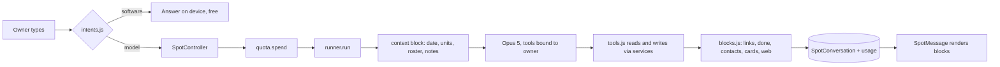

# Spot, phase 4: reach, hands, and cost

Status: **all eight todos built** (2026-09-13): 1 to 5 in `0cf17c9`, 6 to 8 in
`90a1377`; the first live eval ran 2026-09-14 (14 of 16) and its two fixes are
`15b7ca3` - see "Eval runs" in the first plan. Written 2026-09-13 against
`9ec369e`, on `feat/store-and-tracking`. Follows [spot-assistant.plan.md](spot-assistant.plan.md),
whose three phases are built (todo 8 `7cca3b3`). Brief from Lewy: "give Spot
more features, more tools, better efficiency; ensure it is A1 from day 1."

Decisions made with Lewy for this phase (2026-09-13):

1. **Playdates.** Spot accepts, declines and cancels directly, with the
   organiser notified the way the app already does it. Creating a new
   invitation is prefilled and opened: the owner taps Send. The never-list
   is amended to that exact line and no further.
2. **Memory** is Spot's notes: facts the owner tells it, kept as a short
   visible list, injected each turn, deletable on screen. No inferred
   summaries.
3. **Pet profiles.** Spot edits a pet's fields with undo and adds a new pet
   through the same path as onboarding. Spot never deletes a pet.
4. **Model.** Opus 5 at low effort for every model turn, and this phase
   stores per-turn usage on the message so a month of real cost can be read
   off before anything is routed to a cheaper model.

Standing rule, unchanged: **never assign to AI what software can do.** Every
item below was checked against it; the ones that are software wear Spot's
voice and cost nothing.

## What Spot has today, and what it cannot reach

Built: 17 tools (9 reads, 6 writes, `open_screen`, `my_chats` behind the
setting), a deterministic layer on the device (emergency, log a weight, open
a screen, what is due, exact toxin hit), three block types (`links`, `done`
with undo, `contacts`), streaming, quota, consent, flagging, photos
forwarded and never stored, six entry points plus the hub card, the eval.

Not reachable from Spot, though the app has it:

| The app has | Spot has |
| --- | --- |
| a weight history and trend per pet ([PetWeightScreen.js](../../PetPalsConnectApp/src/screens/pet/PetWeightScreen.js)) | the latest weigh-in only |
| pals ([FriendController.getAllFriends](../../backend/controllers/FriendController.js)) and matches (`/api/petmatches/matched-pets`) | nothing that names a pal's pet, so "plan a playdate with Max" cannot resolve Max |
| saved places (`Favorite.location`) | `care_places_nearby` only, which does not know your vet is your vet |
| notifications with `readStatus` | nothing; "did I miss anything?" is unanswerable |
| care picks per pet ([recommend.js](../../backend/services/petCare/recommend.js)) | nothing; "what food should I buy" is a guess |
| accept / decline / cancel a playdate | read only |
| edit a pet, add a pet | read only |
| support messages | nothing; "talk to a human" has no route |
| five kept conversations, `listConversations()` in [spot.js](../../PetPalsConnectApp/src/api/spot.js) | **no screen calls it** - the conversations exist and cannot be opened. The reachability defect again, one level down. |

And two costs that are software's to remove: the prompt says "call `my_pets`
first for any question about a pet", which is a tool round-trip (an extra
model iteration, roughly 600 tokens and a second or two of latency) on
almost every turn, to fetch a roster the server already has in hand; and
`historyMessages()` in [runner.js](../../backend/services/spot/runner.js)
has no cap, so a long conversation grows linearly in cost and nothing in
the history is cached between turns.

## Architecture

Nothing new in shape. Every addition is one of four existing patterns:

- **A tool is a `betaTool` in [tools.js](../../backend/services/spot/tools.js)** bound to
  `userId`, guarded, returning `json()`, pushing an effect. Writes go through
  a service that the controller also calls - the phase 1 lift (`weights.js`,
  `healthRecords.js`) repeated for playdate responses and pet writes, because
  a second writer is the bug shape this codebase keeps finding.
- **A block is mechanical** in [blocks.js](../../backend/services/spot/blocks.js), never
  prompted. Two new kinds, `cards` and `web`, and a `done` that carries no
  undo when the action reached another person.
- **The device answers what it can** in [intents.js](../../PetPalsConnectApp/src/screens/spot/intents.js)
  before the model is asked; software turns stay free.
- **Per-turn context is a text block the server appends to the user
  message**, not to the system prompt, so the cached `tools -> system`
  prefix stays frozen and the roster still arrives every turn.



## Efficiency, in order of how much each saves

**E1. The roster travels with the message.** The controller builds a short
context block per turn - today's date and local time (from the app's
`utcOffsetMinutes`, already sent), units, one line per pet (`petId`, name,
species, breed, age, weight, vaccination status), and the notes - and
appends it to the user message as a second text block. The prompt changes
from "call `my_pets` first" to "the roster in the message is current; call
`my_pets` only when you need temperament, activity or the latest weigh-in
date". Expected: one fewer iteration on most turns. Pure function
`contextBlock({ now, offset, units, pets, notes })` in a new
`services/spot/context.js`, tested on its text.

**E2. A window on history, and a cache breakpoint on it.** `historyMessages`
keeps the last 20 messages (10 turns) and drops the oldest first; the last
history block carries `cache_control: { type: "ephemeral" }` so turn N+1
reads turn N's prefix from cache rather than paying for it again (the SDK
accepts `cache_control` on message content blocks - verified in the
installed `@anthropic-ai/sdk` 0.125 types). Three breakpoints in use:
tools, system, history; the limit is four.

**E3. Usage on the row.** `SpotMessage.usage { input, output, cacheRead,
cacheWrite, iterations, ms }` written on every model turn, and
`GET /api/spot/usage` (moderator, `GUARDED_READS`) summing the last 30 days
into turns, tokens and an estimated dollar figure from a `PRICES` table in
`client.js` keyed by model, source-noted. The decision about a cheaper
model is made from this, not from a guess.

**E4. More software turns.** New intents on the device: "how much does
Bella weigh" and "how old is Bella" (answered from the profile), unit
conversions ("12 kg in pounds", via `units.ts`), "my orders", "my
playdates", "my settings", "my notifications" (open the screen), "call the
vet" (contacts). Chips become context-aware: on a pet's health screen the
first chip is "What's due for Bella?", on weight it is "Log a weigh-in".

**E5. Tool results are capped.** Health records newest 30, article search
5 stubs, places 8, playdates 10, notifications 10, weight history 12. A
result the model cannot use is tokens spent twice, once in and once
reasoned over.

Kept as is: `effort: low`, `max_iterations: 6`, `max_tokens: 2048`,
parallel tool use (the SDK default; `disable_parallel_tool_use` exists and
stays off), photos at 1024 / q0.6.

## Tools

### Reads

| Tool | Source | Scope |
| --- | --- | --- |
| `weight_history(petId)` | `WeightEntry` newest 12 + change over 30 and 90 days computed in software | own pet |
| `my_pals` | `Friend` rows as `getAllFriends` reads them: pal pet name, breed, owner username, `petId` | caller's friendships |
| `my_matches` | `PetMatch` as `fetchMatchedPets()` unwraps: the other pet's name, breed, owner username, `petId` | caller's matches |
| `my_saved_places` | `Favorite.location` populated: name, categories, `locationId` | caller |
| `whats_new` | unread `Notification` newest 10: type label, content, `data` ids | caller |
| `care_picks(petId)` | `recommend.forPet` as the hub shows it: categories with search links; `seeAVet` when `specialNeeds` is set, exactly as the hub does; insurance excluded | own pet |

Pals and matches name other users' pets and usernames. That is what the
app already shows the caller on those screens, and it is the one way
"plan a playdate with Max" can resolve Max. Nothing about a stranger.

### Writes

| Tool | Service | Block |
| --- | --- | --- |
| `respond_to_playdate(playdateId, "accept" or "decline")` | `services/playdates.js` lifted from `acceptPlaydate` / `declinePlaydate` | `done`, **no undo**: the organiser has been told, and the card says so |
| `cancel_playdate(playdateId, reason)` | lifted `cancelPlaydate` | `done`, no undo, same reason |
| `update_pet(petId, fields)` | `services/pets.js` `update` lifted from `updatePet`, allowlist minus `photos`, `weight`, `location` | `done` with undo `restorePet` carrying the previous values |
| `add_pet(name, species, breed?, ageYears?, weightPounds?, temperament?)` | `services/pets.js` `create` lifted from `createPet`, matching side effect included | `done` with an "Open pet" link, no undo (Spot never deletes a pet) |
| `remember(text)`, `forget(noteId)` | `User.spotNotes` subdocuments, 20 max, 140 chars each | `done` with undo (`forget` / re-`remember`) |
| `contact_support(message)` | the existing `createSupportMessage` path: name and email from the token | `done`, no undo |
| `plan_playdate(theirPetId, myPetId?, locationId?, date?, time?, notes?)` | none - returns a `links` chip to `SchedulePlaydate` with those params | `links`, labelled "Review and send" |

`plan_playdate` is the prefilled shape from decision 1: Spot resolves the
pet through `my_matches`, the place through `my_saved_places` or
`care_places_nearby`, and the time from the sentence, and the owner taps
Send on a form that is already filled in. `SchedulePlaydateScreen` grows
`presetDate`, `presetTime`, `notes` and `myPetId` params beside the
`locationId` it already reads; `link()` in `blocks.js` allows extra params
for that one screen through an `extra` list on its `SCREENS` entry, and
`navigation.test.js` sees literal keys.

`add_pet` asks once when a dog or cat has no weight, since the schema
requires one for those species and the matcher needs it; the prompt says
so. A new pet lands on `user.pets` through `$addToSet` exactly as onboarding
does, so the `hasPet` gate reads it.

`WRITE_TOOLS` in `tools.js` gains the six new names, which is what makes
`spot.test.js` demand a two-account case for each.

## The app

- **Blocks.** `cards` (title, subtitle, optional thumbnail, a `links` chip
  each) for article results, places, pals and playdates; `web` (label, url,
  opened with `Linking`) used by `care_picks` only; `done` renders without
  an undo button when the block carries none. `UNDO` in `api/spot.js` gains
  `restorePet` and `forget`/`remember`.
- **Recent conversations.** A "Recent" control in the Spot header opens a
  list of the five with title, date and swipe-to-delete, calling the
  `listConversations()` and `deleteConversation()` that already exist.
  Reachability first: this is the one item in the phase that is a bug.
- **Spot's notes.** A "What Spot remembers" list reached from the same
  header, rows with delete, empty state "Tell Spot something worth
  remembering". `GET /api/spot/notes`, `DELETE /api/spot/notes/:noteId`.
- **Entry points** on four more screens through the existing
  `AskSpotButton`: `PlaydateDetails` (context `playdateId`, prefill "Reply
  to this playdate"), `OrderDetail` (`orderId`), `PetTracking` (`petId`),
  and `ChatDetails` only while `readChats` is on (context `chatId`).
  `describeContext` learns the three new shapes.
- **Types.** `SpotBlock` union gains `cards` and `web`; `SpotMessage` gains
  `usage`; `SpotNote` is new. `types.test.js` checks them against the
  schema as it does the rest.

## Files

### Backend

| File | Change |
| --- | --- |
| [services/spot/context.js](../../backend/services/spot/context.js) | new: `contextBlock()` pure |
| [services/spot/runner.js](../../backend/services/spot/runner.js) | history window, cache breakpoint on history, context block appended, usage returned with iterations and ms |
| [services/spot/prompt.js](../../backend/services/spot/prompt.js) | roster rule, notes rule, playdate responses allowed, `add_pet` asks for weight once, never-list amended |
| [services/spot/tools.js](../../backend/services/spot/tools.js) | 6 reads, 7 writes, result caps, `WRITE_TOOLS` |
| [services/spot/blocks.js](../../backend/services/spot/blocks.js) | `cards`, `web`, `done` without undo, `SCREENS.SchedulePlaydate.extra` |
| [services/spot/client.js](../../backend/services/spot/client.js) | `PRICES` per model, `costOf(usage)` |
| [services/playdates.js](../../backend/services/playdates.js) | new: `accept`, `decline`, `cancel` lifted; `PlaydateController` calls them |
| [services/pets.js](../../backend/services/pets.js) | new: `create`, `update` lifted; `PetController` calls them |
| [models/User.js](../../backend/models/User.js) | `spotNotes: [{ text, createdAt }]` |
| [models/SpotConversation.js](../../backend/models/SpotConversation.js) | `usage` on a message |
| [controllers/SpotController.js](../../backend/controllers/SpotController.js) | builds the context block, stores usage, `getNotes`, `deleteNote`, `getUsage` |
| [routes/spot.js](../../backend/routes/spot.js) | `GET /notes`, `DELETE /notes/:noteId`, `GET /usage` (moderator) |
| [services/authAudit.js](../../backend/services/authAudit.js) | `SpotController.getUsage` in `GUARDED_READS` |
| [scripts/spotEval.js](../../backend/scripts/spotEval.js) | cases for a playdate response, a pet edit, a new pet, a note, a prefilled playdate link, and a roster-answerable question asserting zero tool iterations |

### App

| File | Change |
| --- | --- |
| [src/screens/spot/intents.js](../../PetPalsConnectApp/src/screens/spot/intents.js) | profile facts, conversions, four more opens, contacts; context chips |
| [src/screens/spot/SpotScreen.js](../../PetPalsConnectApp/src/screens/spot/SpotScreen.js) | header controls, Recent list, notes list, three context shapes |
| [src/components/spot/SpotMessage.js](../../PetPalsConnectApp/src/components/spot/SpotMessage.js) | `cards`, `web`, `done` without undo |
| [src/api/spot.js](../../PetPalsConnectApp/src/api/spot.js) | notes calls, `UNDO.restorePet`, `UNDO.forget` |
| [src/screens/playdate/SchedulePlaydateScreen.js](../../PetPalsConnectApp/src/screens/playdate/SchedulePlaydateScreen.js) | `presetDate`, `presetTime`, `notes`, `myPetId` params |
| `PlaydateDetailsScreen.js`, `OrderDetailScreen.js`, `PetTrackingScreen.js`, `ChatDetailsScreen.js` | `AskSpotButton` |
| [src/types/api.ts](../../PetPalsConnectApp/src/types/api.ts) | `cards`, `web`, `usage`, `SpotNote` |
| [tools/gallery/boards.js](../../PetPalsConnectApp/tools/gallery/boards.js) | `spot-cards`, `spot-recent`, `spot-notes`, `spot-playdate-done` |

## Todo

| id | content | status |
| --- | --- | --- |
| 1 | Context block, history window with cache breakpoint, usage stored on the message; `context.js` tests, runner tests | done `0cf17c9` |
| 2 | Lift playdate accept/decline/cancel into `services/playdates.js` and pet create/update into `services/pets.js`; controllers call them; existing tests stay green | done `0cf17c9` |
| 3 | Six read tools with result caps and a two-account test each | done `0cf17c9` |
| 4 | Seven write tools, `User.spotNotes`, notes routes, `WRITE_TOOLS`, two-account tests, `SchedulePlaydate` extra params in `blocks.js` | done `0cf17c9` |
| 5 | `PRICES`, `GET /api/spot/usage` behind `requireModerator`, `GUARDED_READS`, test | done `0cf17c9` |
| 6 | App: `cards` and `web` blocks, `done` without undo, `UNDO` entries, `SchedulePlaydate` presets, Recent conversations, notes list, types | done `90a1377` |
| 7 | App: new intents and context chips with tests; `AskSpotButton` on four more screens; `describeContext` | done `90a1377` |
| 8 | Prompt update, eval cases, gallery boards and screenshots reviewed, results recorded here | done `90a1377` |

Todos 1 and 2 first, in either order; 3 to 5 on the backend; 6 and 7 on the
app; 8 last. Two sessions of work: 1 to 5 in one, 6 to 8 in the next.

Built as planned, with four departures worth knowing: `POST /api/spot/notes`
exists as well as the get and delete, because undoing a "forget" needs a
way to put the note back; `whats_new` names a destination screen but only
offers a chip for screens that take no id, since a notification row stores
no id to open with; the lift of `cancelPlaydate` closed a hole (it updated
whatever id it was given - now 403 for anyone not on the playdate, tested);
and the support mailer is silent under `NODE_ENV=test` so a developer's
real credentials never mail a test inbox. The app's undo table already
carries `restorePet`, `forget` and `remember`, because the backend contract
test demands it; the rest of todo 6 is still to do.

Todos 6 to 8 as built (`90a1377`): the `cards` block was not added - the
`links` chips already carry a label per article, place and pal, and a
card would add a subtitle and a thumbnail to the same tap; add it when a
design review asks for the pictures. The `web` block, the `done` card with
no undo, the schedule presets, the Recent and notes panels (reachable from
the Spot header, and by `route.params.panel` for the boards) and the four
entry points are in. New on-device intents: a weight or an age off the
profile, unit conversions, and bare "my orders"; "my notifications" was
dropped since there is no such screen on `AppStack`. Boards `spot-actions`,
`spot-recent`, `spot-notes` reviewed in both themes. App suite green
except the known Home flake, which passes alone; backend suite green in
every Spot file. The eval has seven more cases and grades a roster
question on its iteration count. It ran on 2026-09-14: 14 of 16, and both
failures were the runner's and the roster's, fixed in `15b7ca3` and recorded in
the first plan under "Eval runs".

## Env vars and dashboard prerequisites

None new. `ANTHROPIC_API_KEY` and `SPOT_MODEL` as before; `MODERATOR_EMAILS`
gates the usage route the way it gates flagged answers.

## Test plan

Backend, from `backend/`:

```bash
npm run lint && npm run check:schemas && npm run check:auth && npm test
node --test test/spot.test.js test/spotTools.test.js test/spotBlocks.test.js
```

App, from `PetPalsConnectApp/`:

```bash
npm run lint && npm run typecheck && npm run check:colours && npm test
EXPO_PUBLIC_GALLERY=1 npx expo export --platform web --output-dir dist-gallery && node tools/gallery/shoot.mjs
npx expo export --platform android && npx expo export --platform ios
```

Live, with the key, after the prompt changes land:

```bash
cd backend && npm run eval:spot
```

New tests and what they hold:

- `test/spotContext.test.js` - the context block text for zero, one and
  three pets; notes included and capped; the date in the owner's offset.
- `test/spot.test.js` - history window drops oldest first; the last history
  block carries the cache breakpoint; usage lands on the stored message;
  the notes routes are scoped to the caller; `GET /usage` is 403 without the
  moderator email and sums correctly with it.
- `test/spotTools.test.js` - two accounts and an outsider for each new
  tool: a pal's pet resolves and a stranger's does not; `respond_to_playdate`
  refuses an invitation not addressed to the caller with the same words the
  controller uses; `update_pet` cannot touch another owner's pet; `add_pet`
  lands on `user.pets`; notes cap at 20.
- `test/playdates.test.js`, `test/pets.test.js` - unchanged and green after
  the lift, which is the point of the lift.
- App: `intents.test.js` for every new intent and the context chips;
  `SpotMessage.test.js` for `cards`, `web`, and a `done` with no undo;
  `SpotScreen.test.js` for Recent and notes; `SchedulePlaydateScreen.test.js`
  for the presets; `navigation.test.js` picks up the four new entry points.

Manual smoke, on a device with the key: "accept Sam's playdate" shows a
done card that says Sam has been told; "we got a kitten called Miso" asks
once for a weight then adds her and offers "Open pet"; "plan a playdate
with Max at the park Saturday at 10" opens the form filled in; "remember
Bella hates thunderstorms" then a new conversation "anything I should know
about storms" uses the note without a tool call.

## Risks and open questions

- **A response to a playdate reaches another person.** Decided and scoped:
  only invitations already on the caller's table, only through the existing
  service with the existing notification wording, never an invitation of
  Spot's own. The `done` card says the organiser was told, and the prompt
  says to do it only when clearly asked. The Terms and listing text make no
  claim this contradicts; the plan's never-list is amended.
- **Pals and matches in the tool list name other users.** Only ones the
  caller can already see on the pals and matches screens, and `my_chats`
  already set the precedent behind a setting. Nothing here is behind a
  setting because nothing here reads another person's words.
- **Notes are the owner's words about their own life.** Injected every turn,
  so they reach Anthropic every turn; the privacy row already covers text
  the owner types to Spot. Capped and visible so nothing accumulates unseen.
- **The roster in the message is a cache the model must trust.** Built
  fresh per turn from the database, so it cannot be stale within a turn; a
  pet added mid-conversation appears on the next turn.
- **Cost figures stay estimates** until the usage route has a month of
  rows. `PRICES` names its source date and the eval prints tokens per case.

Deliberately absent, each its own decision later: voice (a native speech
module), proactive Spot (decided against in phase 1), a cheaper model
(measure first, decision 4), collar sharing writes (location is the most
sensitive data here and the share screen is two taps), automatic
conversation summaries (decision 2), anything that deletes, messages,
blocks, reports, or spends money.

## Skills for implementation

Domain tags: LLM integration, security (writes that reach other users),
UI/UX, testing.

- Read during planning: `ultimate-planner`, the per-repo map, and the
  `claude-api` skill from the first plan; SDK facts here (message-level
  `cache_control`, `disable_parallel_tool_use`, `pause_turn`) were checked
  against the installed `@anthropic-ai/sdk` 0.125 type definitions rather
  than memory. Context7 and web research were not needed: nothing external
  changes in this phase.
- Invoke per todo: `claude-api` for todo 1 (caching breakpoints and usage
  fields), `security-review` after todo 4 (six new write paths), `ponytail`
  throughout, `frontend-design` for the Recent and notes surfaces in todo 6.
- Installs: none.
