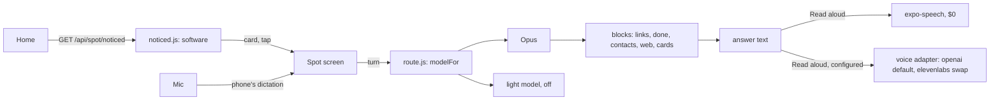

# Spot, phase 5: noticing, voice, cards, and the router in waiting

Status: **planned, not started.** Written 2026-09-14 against `f2e9af4`, on
`feat/store-and-tracking`. Follows [spot-phase-4.plan.md](spot-phase-4.plan.md)
(all eight todos built, three live evals, the last one clean). Brief from
Lewy: keep going with Spot.

Decisions made with Lewy for this phase (2026-09-14):

1. **Proactive** is a "Spot noticed" card on Home, built by software from the
   app's own data, no model turn, tapping it opens Spot with the question
   prefilled. No push from Spot.
2. **Voice in** is speech-to-text into the box, transcribed by the phone.
   **Voice out** is planned in two steps: the phone's own voice first, then
   an AI voice from a provider that is good and cheap, ElevenLabs among the
   candidates, behind the same optional-integration pattern as Places and
   the collar.
3. **Cards** for articles, places and pals: thumbnail, subtitle, the same tap
   the chip had.
4. **The router** is built now and shipped off: a software classifier picks
   the model per turn behind an env flag, so switching some turns to Sonnet
   later is a config change with an eval run in front of it.

Standing rule, unchanged: never assign to AI what software can do. The card
is software, the router is software, the phone transcribes, and the first
voice out is the phone's.

## What each piece is, and why this shape

### 1. "Spot noticed" on Home

The app already knows everything a nudge needs and has never put it in one
place: `vaccinations.statusForPets` says `expired` / `expiringSoon` /
`partial` / `unknown` per pet, `HealthRecord.expiresAt` says what repeats
and when, `WeightEntry` says when a dog or cat was last weighed, `Playdate`
rows with `status: "pending"` and the caller in `participants` (not the
creator) are invitations waiting for an answer, and a profile with no
records at all is the most common state of a new account.

`services/spot/noticed.js` is a pure function `noticesFor({ pets, statuses,
dueRecords, lastWeighed, pendingPlaydates, now })` returning at most three
`{ id, text, question, screen, params }` in a fixed priority: an invitation
waiting, a lapsed or lapsing vaccine, a repeating treatment due within seven
days, a dog or cat not weighed in ninety days, a pet with no records. Each
`text` is one sentence in Spot's voice ("Bella's rabies certificate lapses
in 12 days") and each `question` is what tapping the card asks Spot ("Is
Bella due for anything?"), which for three of the five kinds the device
answers for free through `intents.js`. `GET /api/spot/noticed` gathers and
calls it; 503 when Spot is off like every Spot route. No new model, no
scheduler, nothing stored: it is computed on read, which is what makes it
free.

The card sits on Home under the shortcuts, only when `useSpotEnabled()` is
true and the list is non-empty, showing the first notice with a "and 2
more" line when there are more. Tap: `navigate("Spot", { prefill:
question, context: { screen: "home" } })`. Dismissing is not built: the
notice goes away when the thing is done, which is the point.

### 2. Voice in: the phone transcribes

`expo-speech-recognition` (jamsch) at `^57.0.0`, which is the release
tagged for Expo SDK 57 / React Native 0.86, with a config plugin that writes
the microphone and speech-recognition permission strings and the Android
package-visibility entry. It wraps `SFSpeechRecognizer` and Android's
`SpeechRecognizer`, so the transcription is the phone's: nothing new reaches
Anthropic, and on iOS the audio goes to Apple's dictation service unless
`requiresOnDeviceRecognition` is on (it stays off: on-device needs a
downloaded model on Android and iOS 17+, and the network path is what the
keyboard's own dictation already uses). **It needs a development build**;
Expo Go cannot load it. `eas.json` already has the `development` profile
with `developmentClient: true`.

In the composer: a microphone button beside the camera. Press: request
permission through the module (`requestPermissionsAsync`), then `start({
lang, interimResults: true, continuous: false })`; interim results replace
the draft as they arrive; the final result leaves the text in the box and
the person taps Send, or, in hands-free mode, it sends. Errors map to plain
sentences: `not-allowed` says where the setting lives, `service-not-allowed`
says dictation is off on this phone. The permission is asked the way
`services/location.js` asks: a sentence first, saying the phone's dictation
service hears the audio, then the OS prompt. Same rule as location, same
reason.

Testing: the module is mocked in jest like `expo-location` is; the
transcript flow (interim, final, error) is driven through the mock's
listeners. The gallery web build gets a stub in `tools/web-stubs/` (the
module's web path wants the browser's `SpeechRecognition`, which headless
Chromium does not offer); `tooling.test.js` keeps the stub out of the
device bundle as it does the others.

### 3. Voice out, in two steps

**Step one, phase 5: the phone's voice.** `expo-speech` (`Speech.speak`) on
a "Read aloud" control on each of Spot's answers, stopping on unmount and
when another starts. Zero cost, no permission, works offline, present on
every device. **Hands-free**: when the question came in by voice, the
answer is read aloud without a tap, and the microphone re-arms after the
answer ends; typing turns it off. That is the car-park case.

**Step two, a todo in this plan, off until configured: an AI voice.** The
phone's voices are serviceable and nobody would call them warm. The shape
is the tracking vendor's: `services/spot/voice/` with one adapter per
provider exposing `speak({ text, voice }) -> audio stream`,
`SPOT_VOICE_PROVIDER` read at call time, unset meaning the route answers 503
and the app shows only the phone's voice. `POST
/api/spot/conversations/:id/messages/:messageId/audio` synthesises Spot's
stored answer text (never the person's words, never the roster) and streams
MP3 back; the app plays it with `expo-audio`. Nothing is stored; a second
tap synthesises again, which at these prices is cheaper than a cache.

Which provider, from the September 2026 price pages (see Web research
notes; Spot's answers average about 90 output tokens, roughly 400
characters, so the figures below are per spoken answer):

| Provider, model | Price | Per answer | Streams | Notes |
| --- | --- | --- | --- | --- |
| Phone's own voice (`expo-speech`) | $0 | $0 | n/a | step one; robotic but instant and offline |
| OpenAI `gpt-4o-mini-tts` | about $0.015 a minute of audio | about $0.5c | yes | steerable tone by instruction; one vendor already on the price table |
| ElevenLabs Flash v2.5 | $50 per 1M characters | about 2c | yes | the quality reference; roughly 75 ms model latency claimed, 250-300 ms measured |
| Cartesia Sonic | about $39 per 1M characters on the $49 plan | about 1.6c | yes | lowest latency; plan-based |
| Deepgram Aura-1 / Aura-2 | $15 / $30 per 1M characters | 0.6c / 1.2c | yes | English only |
| Google Neural2, Polly Neural | $16 per 1M characters | 0.6c | Polly yes | 1M free characters a month on Google |

**Recommendation: OpenAI `gpt-4o-mini-tts` as the default adapter, and an
ElevenLabs Flash adapter beside it as the swap.** Both are one HTTP call
returning audio. OpenAI is a third of ElevenLabs' price at a quality most
people would not fault, and an `instructions` string ("warm, unhurried,
plain") does what Spot's prompt does for text. ElevenLabs is the voice
people mean when they say a voice sounds good; if the read-aloud rate turns
out high and the difference matters, `SPOT_VOICE_PROVIDER=elevenlabs` is
the change. Either way a spoken answer costs more than the model turn that
wrote it (0.9c), so read-aloud is a tap, never automatic outside hands-free,
and `limits.spot` counts it. The privacy policy's processor table gets a
row for whichever is configured, saying that Spot's answer text is sent to
synthesise it.

### 4. Cards

A `cards` block: `{ type: "cards", items: [{ title, subtitle, image, chip }]
}`, at most six, deduped by the chip's key. Three tools emit `card` effects
beside the `link` they already emit: `search_articles` (title, summary as
subtitle, the `ArticleDetail` chip), `care_places_nearby` (name, address
and distance, the place chip), `my_pals` (pet name, breed and "with
@username", the pet's first photo, the `PetDetails` chip; the tool selects
`photos` now). `blocksFrom` folds cards and drops the plain chip for a
screen that has a card, so nothing is offered twice. The app renders a
horizontal row of `Card`s with the photo or an icon, the title, the
subtitle, and the tap; the gallery board `spot-cards` shows all three
kinds. `types.ts` gains the union member.

### 5. The router, shipped off

`services/spot/route.js` is a pure function `modelFor({ text, image,
historyLength })` returning a model name from two env values: `SPOT_MODEL`
(the default, Opus) and `SPOT_MODEL_LIGHT` (unset by default, which makes
the function always answer `SPOT_MODEL`). When the light model is set, a
turn goes to it only if all of these hold: no photo; the text matches none
of the health, toxin, emergency, dose or symptom vocabulary (a word list
in the module, tested); the text matches no write verb the tools act on
(log, add, record, remember, accept, decline, cancel, update, remove,
forget, send); and the conversation is not already on Opus (a conversation
stays on the model it started with, so a light turn never inherits a
health thread). The runner takes `model` as a parameter, `usage.model` on
the row already records which ran, and the usage route already sums per
model, so the day it is switched on the cost split is visible by the next
morning.

The eval gains `--model <name>`, which forces every case onto that model
and is the gate: the light model is allowed into the classifier's set only
after the full sixteen pass on it. Nothing else changes for this phase; the
flag stays unset in `.env.example` with a sentence saying what it does.



## Files

### Backend

| File | Change |
| --- | --- |
| [services/spot/noticed.js](../../backend/services/spot/noticed.js) | new: `noticesFor()` pure + `gather(userId)` |
| [services/spot/route.js](../../backend/services/spot/route.js) | new: `modelFor()`, the vocabulary lists |
| [services/spot/voice/index.js](../../backend/services/spot/voice/index.js), `openai.js`, `elevenlabs.js` | new: provider adapters, `isEnabled()`, `speak()` |
| [services/spot/runner.js](../../backend/services/spot/runner.js) | `model` parameter |
| [services/spot/tools.js](../../backend/services/spot/tools.js) | `card` effects in three tools; `my_pals` selects photos |
| [services/spot/blocks.js](../../backend/services/spot/blocks.js) | `cards` block, chip folding |
| [controllers/SpotController.js](../../backend/controllers/SpotController.js) | `getNoticed`, `getAudio`, `modelFor` on send |
| [routes/spot.js](../../backend/routes/spot.js) | `GET /noticed`, `POST /conversations/:id/messages/:messageId/audio` |
| [scripts/spotEval.js](../../backend/scripts/spotEval.js) | `--model` |
| [.env.example](../../backend/.env.example) | `SPOT_MODEL_LIGHT`, `SPOT_VOICE_PROVIDER`, `OPENAI_API_KEY`, `ELEVENLABS_API_KEY`, `SPOT_VOICE_ID` |
| [docs/privacy.html](../../docs/privacy.html) | processor row for the voice provider; "your phone's dictation service" under voice in |

### App

| File | Change |
| --- | --- |
| [app.json](../../PetPalsConnectApp/app.json) | `expo-speech-recognition` plugin with the two permission strings |
| [src/screens/bottomTab/HomeScreen.js](../../PetPalsConnectApp/src/screens/bottomTab/HomeScreen.js) | the noticed card |
| [src/screens/spot/SpotScreen.js](../../PetPalsConnectApp/src/screens/spot/SpotScreen.js) | mic button, hands-free, read aloud, audio playback |
| [src/services/dictation.js](../../PetPalsConnectApp/src/services/dictation.js) | new: the one way the app asks to listen, with the disclosure sheet |
| [src/components/spot/SpotMessage.js](../../PetPalsConnectApp/src/components/spot/SpotMessage.js) | `cards`, read-aloud control |
| [src/api/spot.js](../../PetPalsConnectApp/src/api/spot.js) | `fetchNoticed`, `fetchAudio` |
| [src/types/api.ts](../../PetPalsConnectApp/src/types/api.ts) | `cards`, `SpotNotice` |
| [tools/web-stubs/](../../PetPalsConnectApp/tools/web-stubs/) | speech-recognition stub for the gallery |
| [tools/gallery/boards.js](../../PetPalsConnectApp/tools/gallery/boards.js) | `home-noticed`, `spot-cards`, `spot-listening` |

## Todo

| id | content | status |
| --- | --- | --- |
| 1 | `noticed.js` pure function with tests for each kind and the priority; `GET /api/spot/noticed`; contract picks up the route | pending |
| 2 | Home card: fetch, render, tap prefills Spot; `HomeScreen.test.js` cases; board | pending |
| 3 | `cards` block: three tools emit, `blocksFrom` folds, `spotBlocks.test.js`; app renderer, types, board | pending |
| 4 | `route.js` with vocabulary tests; runner `model` param; `SPOT_MODEL_LIGHT` in env example; eval `--model` | pending |
| 5 | Voice in: module + plugin + web stub, `dictation.js` with the disclosure, mic button with interim results, error copy, tests; privacy sentence | pending |
| 6 | Voice out, step one: `expo-speech` read-aloud control, hands-free mode, tests | pending |
| 7 | Voice out, step two: adapters (OpenAI default, ElevenLabs), audio route behind `SPOT_VOICE_PROVIDER`, `expo-audio` playback, limiter, privacy row, two-account test on the route | pending |
| 8 | Development build, on-device pass of the mic and the voices, eval run, boards reviewed, plan record | pending |

1 to 4 are one session on the backend with the app halves of 2 and 3; 5 to
8 are the second, and 8 needs a phone.

## Env vars and dashboard prerequisites

- `SPOT_MODEL_LIGHT` (optional; unset = router off). Set to `claude-sonnet-5`
  only after `npm run eval:spot -- --model claude-sonnet-5` passes.
- `SPOT_VOICE_PROVIDER` (optional; `openai` or `elevenlabs`; unset = no AI
  voice, the phone's voice still works) with `OPENAI_API_KEY` or
  `ELEVENLABS_API_KEY` and an optional `SPOT_VOICE_ID`.
- A development build (`eas build --profile development`) for anything
  after todo 4: the speech module is native.
- App Store privacy labels: microphone (app functionality, not linked); the
  iOS speech-recognition permission string names Apple's dictation.

## Test plan

Backend, from `backend/`:

```bash
npm run lint && npm run check:schemas && npm run check:auth && npm test
node --test test/spotNoticed.test.js test/spotRoute.test.js test/spotVoice.test.js test/spot.test.js test/spotBlocks.test.js
```

App, from `PetPalsConnectApp/`:

```bash
npm run lint && npm run typecheck && npm run check:colours && npm test
EXPO_PUBLIC_GALLERY=1 npx expo export --platform web --output-dir dist-gallery && node tools/gallery/shoot.mjs
npx expo export --platform android && npx expo export --platform ios
```

Live, with the key, after the prompt or model changes and once per model
the router may use:

```bash
cd backend && npm run eval:spot
cd backend && npm run eval:spot -- --model claude-sonnet-5
```

New tests and what they hold:

- `spotNoticed.test.js`: one case per kind, the priority order, three at
  most, nothing for a healthy pet with nothing due, an invitation the caller
  organised is not a notice.
- `spotRoute.test.js`: unset light model means Opus always; each vocabulary
  list sends a matching sentence to Opus; a plain question with the light
  model set goes light; a photo never does; a thread stays where it began.
- `spotVoice.test.js`: 503 with no provider; the route synthesises the
  stored answer text and only that; an outsider gets 404; the adapters are
  called with the configured voice (HTTP stubbed).
- `spotBlocks.test.js`: cards folded and deduped, the chip dropped when a
  card carries it, cap at six.
- App: `HomeScreen.test.js` for the card and the tap; `SpotScreen.test.js`
  for the mic (interim, final, denied), hands-free, read aloud; `SpotMessage`
  cards render and navigate; `dictation.test.js` for the disclosure order.

Manual, on the development build: dictate a question in a noisy place and
watch the interim text; deny the permission and read the sentence; hands-free
a whole exchange; read one answer aloud with the phone's voice and, once a
provider is set, with the AI voice; tap a pal's card.

## Risks and open questions

- **Dictation audio goes to Apple or Google.** That is the keyboard's own
  path and needs no new processor row, but the permission sentence and the
  privacy policy should say it plainly. On-device recognition is a switch
  away if that reads badly.
- **A spoken answer costs more than the answer.** 0.5c to 2c against 0.9c.
  The limiter and the tap keep it bounded; the usage route should learn to
  count spoken characters too, so the month's number is honest.
- **The router is a word list.** A health question phrased with none of the
  words would go light. The eval on the light model is the check, and the
  list errs towards Opus: any doubt is Opus.
- **Voice on a web export.** The gallery cannot listen or speak; the boards
  show the controls, not the behaviour. The device pass in todo 8 is where
  voice is actually seen working.
- **`expo-audio` for playback** is assumed present in SDK 57 (it replaced
  `expo-av`); confirm at install and fall back to `expo-av` if not.

Deliberately absent: push from Spot, speech-to-speech models, wake words,
voice for the person's own messages, storing any audio.

## Skills for implementation

Domain tags: LLM integration, native modules, audio, UI/UX, security,
testing.

- Read during planning: `ultimate-planner`, the per-repo map; the SDK facts
  came from the module's README and release notes and the price pages
  below, not memory.
- Invoke per todo: `claude-api` for todo 4 (model ids, the eval's second
  model) and todo 7 (the OpenAI audio call shape is not Anthropic's, verify
  against its docs at build time); `frontend-design` for the noticed card
  and the cards row; `security-review` after todos 5 and 7 (a permission
  and a paid route); `ponytail` throughout.
- Installs: `expo-speech-recognition@^57`, `expo-speech`, `expo-audio` in
  the app (native; a development build follows). No plugin with hooks or
  MCP is proposed.

## Web research notes

- `expo-speech-recognition` README: config plugin, permission functions,
  `interimResults`, `continuous`, `requiresOnDeviceRecognition`, the
  platform table, and the note that Android 12 and lower needs the Google
  app for recognition. https://github.com/jamsch/expo-speech-recognition
- Its releases: v57.0.0 "Official support for Expo SDK 57 (React Native
  0.86)", versioning aligned with the Expo SDK from 56; minimum iOS raised
  to 16.4. https://github.com/jamsch/expo-speech-recognition/releases
- `@react-native-voice/voice` last published 2022 (3.2.4); not chosen.
  https://www.npmjs.com/package/@react-native-voice/voice
- Text-to-speech prices, September 2026, secondary summaries of the vendor
  pages (confirm on the vendor page before the first invoice): OpenAI
  `tts-1` $15 per 1M characters, `gpt-4o-mini-tts` $0.60 per 1M text tokens
  plus $12 per 1M audio tokens (about $0.015 a minute); ElevenLabs Flash and
  Turbo $50 per 1M characters, Multilingual v2 and v3 $100; Cartesia Sonic
  about $39 per 1M on the $49 plan; Deepgram Aura-1 $15 and Aura-2 $30;
  Google Neural2 $16 with 1M free a month; Amazon Polly Neural $16.
  https://awesomeagents.ai/pricing/voice-tts-pricing/ ,
  https://techsy.io/en/blog/best-tts-apis-developers ,
  https://gradium.ai/content/how-to-compare-tts-pricing-across-providers-2026 ,
  https://comparevoiceai.com/tts/
- Latency: Cartesia claims 40 to 90 ms and ElevenLabs Flash about 75 ms;
  an independent benchmark quoted at 188 ms and 288 ms respectively.
  https://techsy.io/en/blog/best-tts-apis-developers
