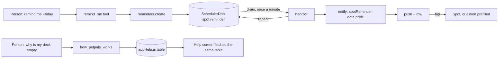

# Spot, phase 6: later, and knowing PetPals

Status: **todos 1 to 6 built** - backend `efe7635`, app `095df73`
(2026-09-14); todo 7's eval cases are written and the run waits on the key.
Written 2026-09-14 against `09813b4`, on `feat/store-and-tracking`. Follows [spot-phase-5.plan.md](spot-phase-5.plan.md)
(todos 1 to 7 built; 8 owed on a phone). Brief from Lewy: "build everything
you just suggested; I really like the idea of Spot knowing PetPals."

What Spot is missing, in one sentence each: **he can only act now**, and
**he does not know the app he lives in**. Two smaller things ride along:
ringing your own vet, and the follow-through the eval transcripts kept
promising ("let me know how Bella does") that nothing could keep.

Decisions made with Lewy for this phase (2026-09-14):

1. **Reminders** are listed and cancelled in a Reminders panel in Spot's
   header, beside Recent and Notes, plus undo on the done card.
2. **Check-ins**: after a health worry Spot offers one, in one sentence,
   and sets it only on a yes. Nothing fires that was not asked for; phase
   1's proactive decision stands.
3. **Repeats**: daily, weekly or monthly reminders are allowed. A series is
   one pending job that re-queues itself when it fires; cancelling the
   pending job ends the series.
4. **Default hour**: a day with no time is 09:00 where the owner is. Quiet
   hours still hold: the row is written and shown, the phone is not lit up.
5. **Push switch**: a new category of its own, "Spot's reminders".
6. **Help table**: one source table on the server; the help screen fetches
   it and Spot reads it. Spot says what premium changes and never a price;
   he says what the Terms and privacy policy cover in a sentence and opens
   the page, never quoting them.

Standing rule, unchanged: never assign to AI what software can do. A
reminder is a scheduler row and a `notify()` call; the help table is a
reviewed diff; the model only decides *when* and *which entry*.

## 1. Later: reminders and check-ins

### What exists

- `services/scheduler.js`: `registerHandler(type, fn)`, `schedule(type,
  payload, runAt)`, a once-a-minute `drain` that claims a `ScheduledJob`
  atomically and retries three times. `ScheduledJob` is `{ type, payload
  (Mixed), runAt, status: pending | running | completed | failed, attempts }`
  with a 30-day TTL on completed rows.
- `services/healthRecords.js` registers `vaccination:due` at module load and
  re-reads the record inside the handler, so a deleted record raises nothing.
  That is the shape to copy.
- `services/NotificationService.notify()` writes the row (with `data`, which
  the app's `destinationFor` reads from the row and from the push alike),
  respects the master switch, the per-category switch and quiet hours, and
  never fails the caller.
- `services/notificationTypes.js` is the one table of types, destinations
  and categories, mirrored in `src/api/notifications.js` and compared entry
  by entry in `types.test.js`; `UserPreferences.notificationPreferences`
  holds one boolean per category and the preferences screen renders
  `CATEGORIES` from the server.

### What to build

**`services/spot/reminders.js`** owns the rule, the way `weights.js` and
`playdates.js` do, so the tool and the routes share one writer:

- `create({ ownerId, text, question, runAt, repeat, petId })`: refuses a
  time in the past (one minute of slack), more than 366 days out, an
  unknown `repeat`, and a 21st active reminder (`MAX_ACTIVE = 20`). Writes
  one `ScheduledJob` of type `spot:reminder` with payload `{ owner, text,
  question, repeat, petId, utcOffsetMinutes }`. Returns the job.
- `list(ownerId)`: pending `spot:reminder` jobs for the owner, soonest
  first. `payload.owner` is queried directly; twenty rows per owner does not
  need an index of its own (ponytail: add `{ type, "payload.owner", status }`
  if the list ever slows).
- `cancel({ ownerId, jobId })`: a pending job of the owner's becomes
  `cancelled` - a new value on the `ScheduledJob` status enum, so a series
  ends without deleting its history. Anything else is a 404.
- `nextRunAt(runAt, repeat, utcOffsetMinutes)`: pure. Daily and weekly add
  whole days; monthly adds a month on the owner's wall clock and clamps to
  the month's last day. Wall clock, not UTC: "every Sunday at 9" stays at 9
  across a daylight-saving change (ponytail: the offset is the one captured
  when the reminder was set; an owner who moves zones gets the old zone's 9
  until they set the reminder again).
- The handler, registered at module load: re-reads the owner (`User`
  exists, else return), calls `notify({ type: "spotReminder", content: text,
  recipientId: owner, petName, data: { prefill: question } })`, then, for a
  repeat, `schedule()`s the next run with the same payload. A cancelled
  series never reaches the handler because `drain` only claims `pending`.

**Notification type**: `spotReminder: { title: "Spot", screen: "Spot",
param: "prefill" }` in both tables; `CATEGORY_OF.spotReminder =
"spotReminders"`; `CATEGORIES` gains `{ key: "spotReminders", label:
"Spot's reminders" }`; `UserPreferences.notificationPreferences` gains
`spotReminders: { type: Boolean, default: true }` (the controller refuses a
key the schema lacks, so the schema is the authority). A tap on the push or
the row opens Spot with the question prefilled, through the same
`destinationFor` every other type uses; the phase 4 prefill param already
exists on the Spot screen.

**Routes**, all the caller's own: `GET /api/spot/reminders`, `POST
/api/spot/reminders` (the undo of a cancel), `DELETE
/api/spot/reminders/:id`. 503 when Spot is off, like the notes routes.

**Tools**: `remind_me({ text, at, repeat?, petId? })` where `at` is an ISO
date-time with offset the model resolves from the note's clock (prompt
rule: a day with no time is 09:00; "tomorrow morning" is 09:00; "tonight" is
20:00; if the person named no day at all, ask once); `question` is written
by the tool as `You asked me to remind you: ${text}` unless the model passes
a check-in question ("How is Bella today?"). `my_reminders()`, and
`cancel_reminder({ reminderId })`. `done` blocks: `remind_me` carries undo
`cancelReminder`; `cancel_reminder` carries undo `restoreReminder` with the
fields to re-create. Both new undo kinds land in the app's `UNDO` table,
which the blocks contract test demands.

**Check-ins are a prompt rule, not a tool**: after any answer that ends at
a vet, offer once - "Want me to check in tomorrow morning?" - and on a yes
call `remind_me` with `at` = next day 09:00 and `question` = "How is
{pet} today?". Never set one unasked. The eval gets the two-turn case.

**Account deletion**: `ScheduledJob.deleteMany({ type: "spot:reminder",
"payload.owner": userId })` in `accountDeletion.js`. `ScheduledJob` carries
no `ref: "User"`, so the cascade test does not force this; the deletion test
gets an explicit case.

**The app**: a third panel, Reminders, on the Spot header with a clock
icon: each row the text, "Sunday 21 September, 09:00", "repeats weekly" when
it does, and a cancel. `fetchReminders`, `createReminder`, `deleteReminder`
in `api/spot.js`; `UNDO.cancelReminder` and `UNDO.restoreReminder`. The
notifications screen needs nothing: `destinationFor` already reads `data`.

## 2. Knowing PetPals: the help table

### What exists

`HelpSupportScreen` holds four FAQs inline and a support form. `PUBLIC_READS`
in `services/authAudit.js` is where a read that is "the same for everyone"
is declared with a reason, and `PetCareController.getToxins` is the shape:
a source table served whole. `src/api/toxins.js` caches the table in
`localCache` and never lets an empty answer replace a good copy.

### What to build

**`backend/services/appHelp.js`**: a source table like `picks.js` and
`toxins.js`, one entry per question people actually ask, each `{ id, topic,
question, answer, screen?, param? }` with `answer` in plain sentences (no
markdown - nothing renders it) and `screen` naming the `AppStack` route that
settles it. Topics and the entries to write, from what the code already
decides:

- **Discover**: why the deck is empty (outside Arizona and waitlisted; no
  dog on the profile - cats and the rest do not match; range set too tight;
  everyone nearby already decided); what a match is (mutual or nothing);
  what premium changes (the wider deck; never a price - "the plan screen
  shows the price for your store").
- **Playdates**: who can accept (only the invited owner, once), who is told
  when one is cancelled, why a place is hidden (the organiser's location
  setting), why only parks and trails are offered.
- **Chats and pals**: a conversation is between two pets; who can message
  you and where that is set; what blocking does (both directions, removes
  every pet of theirs); reporting blocks too.
- **Health**: what "owner-reported" means and why it never says verified;
  what counts as current (the core three, 2022 AAHA); how reminders fire;
  what marking a treatment done does.
- **Pets and photos**: species other than dogs are for the care hub; six
  photos, the first is the face; adding a second pet; deleting a pet.
- **Care hub**: the poison lookup never gives an amount and why; picks are
  categories not products; the insurance card discloses its partner.
- **Account**: deleting the account and what is kept (reports, support
  messages, orders) and why; location is rounded to about a kilometre for
  others; where the Terms and privacy policy are (open, never quote).
- **Spot himself**: what he can and cannot do (the never-list in plain
  words), the daily allowance and that premium lifts it, that a photo is
  never kept, what the notes are, what "read your chats" sends and to whom,
  how to report an answer.

Sixty-odd entries at most; each answer under four sentences. `appHelp.test.js`
reads the table and fails on markdown, on an empty answer, on a `screen`
`AppStack` does not register (the same check `SCREENS` has), on a dollar
sign or a digit followed by "/month" (no prices), and on the word
"verified" about a vaccination.

**Route**: `GET /api/petcare/help` returns the table; `PetCareController
.getHelp` in `PUBLIC_READS` ("the same for everyone, like the toxin
table").

**Tool**: `how_petpals_works({ query })`: the same word-overlap search the
toxin lookup uses over `question + answer + topic`, returning the best five
entries with their `screen`, and a `link` effect for each entry's screen so
the answer offers the button. The prompt gains one line: for any question
about using PetPals, call it before answering, say what it says in your own
words, and offer the screen. The eval gets "why is my deck empty?" and
"what does premium do?" with `expect` patterns, and "how much is premium?"
with a `never: /\$\d/`.

**The help screen**: fetches `/api/petcare/help` through `src/api/help.js`,
cached in `localCache` like the toxin table (the four inline entries are
deleted once the table holds them), grouped by topic, with each entry's
`screen` as a chip. "Ask Spot" at the bottom, prefilling "How does PetPals
work?" - the one screen where that question is the obvious one.

## 3. Ringing your own vet

`my_saved_places` selects `phone` as well (the lazy Places details fill it
on first open of the place, and `withDetails` runs on `GET
/api/locations/:id`; a saved vet nobody has opened has no phone yet, and
the tool says so). A saved place with a phone adds a `contacts` effect
`{ id: locationId, name, phone, note: "your saved place" }`, and the
`contacts` block takes an optional `title` ("Your vet") so the app can draw
it calmly rather than in the emergency red - the same component, one prop.
"Ring my vet" then ends in a tap, the way the helpline does.

## 4. Deliberately not in this phase

The pet's own profile photo as context for the model (only useful once
photos are kept, and they are not); Spot writing to the help table; a
reminder that does anything but notify (no tool runs at fire time, so a
reminder can never write on the owner's behalf while they sleep); push from
Spot that nobody asked for.



## Files

### Backend

| File | Change |
| --- | --- |
| [services/spot/reminders.js](../../backend/services/spot/reminders.js) | new: `create`, `list`, `cancel`, `nextRunAt`, the handler |
| [models/ScheduledJob.js](../../backend/models/ScheduledJob.js) | `cancelled` on the status enum |
| [services/notificationTypes.js](../../backend/services/notificationTypes.js) | `spotReminder`, its category, the switch |
| [models/UserPreferences.js](../../backend/models/UserPreferences.js) | `spotReminders` boolean |
| [services/accountDeletion.js](../../backend/services/accountDeletion.js) | delete the owner's reminder jobs |
| [services/appHelp.js](../../backend/services/appHelp.js) | new: the table and `search()` |
| [controllers/PetCareController.js](../../backend/controllers/PetCareController.js) | `getHelp` |
| [routes/petCare.js](../../backend/routes/petCare.js) | `GET /help` |
| [services/authAudit.js](../../backend/services/authAudit.js) | `PetCareController.getHelp` in `PUBLIC_READS` |
| [controllers/SpotController.js](../../backend/controllers/SpotController.js) | `getReminders`, `addReminder`, `deleteReminder` |
| [routes/spot.js](../../backend/routes/spot.js) | the three reminder routes |
| [services/spot/tools.js](../../backend/services/spot/tools.js) | `remind_me`, `my_reminders`, `cancel_reminder`, `how_petpals_works`; phone on `my_saved_places` |
| [services/spot/blocks.js](../../backend/services/spot/blocks.js) | `contacts` with a title from a `contact` effect |
| [services/spot/prompt.js](../../backend/services/spot/prompt.js) | the check-in rule, the default-hour rule, the help rule |
| [scripts/spotEval.js](../../backend/scripts/spotEval.js) | a reminder, a two-turn check-in, three help questions |
| [docs/privacy.html](../../docs/privacy.html) | reminders in the Spot row of what we collect |

### App

| File | Change |
| --- | --- |
| [src/api/notifications.js](../../PetPalsConnectApp/src/api/notifications.js) | `spotReminder` in the mirror |
| [src/api/spot.js](../../PetPalsConnectApp/src/api/spot.js) | reminder calls, two undo kinds |
| [src/api/help.js](../../PetPalsConnectApp/src/api/help.js) | new: fetch and cache the table |
| [src/screens/spot/SpotScreen.js](../../PetPalsConnectApp/src/screens/spot/SpotScreen.js) | the Reminders panel |
| [src/components/spot/SpotMessage.js](../../PetPalsConnectApp/src/components/spot/SpotMessage.js) | `contacts` title, calm variant |
| [src/screens/settings/HelpSupportScreen.js](../../PetPalsConnectApp/src/screens/settings/HelpSupportScreen.js) | fetched, grouped, chips, Ask Spot |
| [src/types/api.ts](../../PetPalsConnectApp/src/types/api.ts) | `SpotReminder`, `HelpEntry` |
| [tools/gallery/boards.js](../../PetPalsConnectApp/tools/gallery/boards.js) | `spot-reminders`, `help` reshot |

## Todo

| id | content | status |
| --- | --- | --- |
| 1 | `reminders.js` with `nextRunAt` pure and tested (daily, weekly, monthly, month-end, across a DST change), `create` limits, `cancel` scoping, the handler; `cancelled` on the enum; deletion cascade with its test | done `efe7635` |
| 2 | `spotReminder` type in both tables, category and preference switch; `types.test.js` green; handler test proves the push carries `data.prefill` and a repeat re-queues once | done `efe7635` |
| 3 | Reminder routes and the three tools with two-account tests; undo kinds in `WRITE_TOOLS` and the app's `UNDO`; prompt rules for hours and the check-in | done `efe7635` |
| 4 | `appHelp.js` table written and its test (markdown, prices, "verified", unregistered screens); `GET /api/petcare/help` in `PUBLIC_READS`; `how_petpals_works` with tests on three questions | done `efe7635` |
| 5 | Phone on saved places, `contacts` title, calm variant in the app, tests | done `095df73` (5's backend in `efe7635`) |
| 6 | App: Reminders panel with tests; `api/help.js` cached like toxins; help screen fetches, groups, chips, Ask Spot; boards reshot | done `095df73` (5's backend in `efe7635`) |
| 7 | Eval cases: a reminder, the check-in over two turns, three help questions; run with the key; plan record | cases written; the live run is owed |

Two sessions: 1 to 4 on the backend, 5 to 7 across both. Nothing here
needs a phone; the reminder can be watched firing with `scheduler.drain()`
in a test and on the development build from phase 5.

As built, and where it differs from the plan:

- **Daylight saving.** The plan said a weekly reminder holds 09:00 across a
  DST change. It cannot: only an offset is stored, not a zone, so the UTC
  hour holds and the local hour moves by an hour until the reminder is set
  again. The test asserts the UTC hour holds and the `ponytail:` comment
  names the ceiling; a zone name is the upgrade.
- The series successor is found by `text` and `owner` among running jobs,
  so a failure to notify retries the same job rather than forking a series.
- `remind_me` reads the offset off the ISO timestamp the model sends, so a
  repeat keeps the owner's clock without a separate parameter.
- The help table has 36 entries across eight topics. Two entries (picks,
  insurance) point at no screen because the care hub is a tab, not a route.
  `Chats`, `Profile`, `AccountInformation` and `LegalPolicies` joined the
  screens Spot may open so the help chips resolve.
- Counts: backend 815 green with both audits; app 852 green; contract suites
  green with the new route and types. Boards `spot-reminders` and `support`
  reviewed in both themes.

Owed (todo 7): `npm run eval:spot` on this build; the four new cases are a
reminder, and three help questions graded on a screen being offered and no
price being named. The check-in over two turns is proven through the stub
in `spot.test.js`.

## Env vars and dashboard prerequisites

None. Reminders use the scheduler already running from `Server.js`; the
help table is source. The App Store privacy labels do not change: a
reminder is text the person typed, already covered.

## Test plan

Backend, from `backend/`:

```bash
npm run lint && npm run check:schemas && npm run check:auth && npm test
node --test test/spotReminders.test.js test/appHelp.test.js test/spot.test.js test/spotTools.test.js test/types.test.js test/accountDeletion.test.js
```

App, from `PetPalsConnectApp/`:

```bash
npm run lint && npm run typecheck && npm run check:colours && npm test
EXPO_PUBLIC_GALLERY=1 npx expo export --platform web --output-dir dist-gallery && node tools/gallery/shoot.mjs
```

Live, with the key:

```bash
cd backend && npm run eval:spot
```

New tests and what they hold, each written to fail on the specific wrong
behaviour:

- `spotReminders.test.js`: `nextRunAt` for each interval, 31 January
  monthly clamping to 28 February, and a weekly reminder set at 09:00 the
  week before a daylight-saving change still firing at 09:00 local (the UTC
  hour moves); a time in the past, a time 400 days out and a 21st reminder
  refused with the right status; `cancel` from another owner is a 404 and
  the job stays pending; `scheduler.drain()` on a due reminder writes one
  notification whose `data.prefill` is the question and, for a weekly one,
  leaves exactly one new pending job a week later; a cancelled series
  produces no notification on drain; account deletion leaves no job behind.
- `spot.test.js`: the routes are the caller's own; the tool through the
  stub sets a reminder and the done block carries `cancelReminder` with the
  job id; the check-in question is what the push prefills.
- `appHelp.test.js`: every entry passes the content rules; `search("why is
  my deck empty")` ranks the region entry first; the route is public and
  returns the table whole.
- `spotTools.test.js`: `how_petpals_works` offers the entry's screen as a
  chip; `my_saved_places` with a phone adds a titled contacts block and
  without one says so.
- App: `SpotScreen.test.js` lists, cancels and undoes a reminder;
  `HelpSupportScreen.test.js` renders from the fetched table, falls back to
  the cache when the fetch fails, and Ask Spot prefills; `api/help.test.js`
  never replaces a cached table with an empty one; `notifications.test.js`
  routes a `spotReminder` row to Spot with its prefill.

Manual: set "remind me in two minutes to check Bella's water", watch the
push land and open Spot prefilled; set a weekly one, cancel it in the panel,
see the undo bring it back; ask "why is my deck empty?" from a cat-only
account and get the species answer with the add-a-pet button.

## Risks and open questions

- **A reminder is a promise the server keeps.** If the API is down at the
  minute, `drain` runs it late rather than never - the job stays pending.
  Late is honest; the row says when it was meant for.
- **The help table can go stale the way the Terms can.** Every entry cites a
  rule that lives in code; a rule that changes needs the entry changed. The
  test catches shape, not truth. Re-read the table when a section of
  CLAUDE.md changes.
- **Repeats and time zones.** The captured offset is the one at set time;
  a move across zones shifts the hour until the reminder is set again. Said
  in the plan and in a `ponytail:` comment, not hidden.
- **The model resolves the time.** "Friday" from the note's clock is
  arithmetic the model does well, and the tool refuses the past and the far
  future; the eval's reminder case asserts the stored `runAt` is the
  expected day at 09:00.

## Skills for implementation

Domain tags: LLM integration, scheduling, notifications, content, UI/UX,
security, testing.

- Read during planning: `ultimate-planner`, the per-repo map; the scheduler,
  notification and preference code above. No Context7 or web research:
  nothing external changes in this phase.
- Invoke per todo: `claude-api` for the eval's two-turn case (todo 7);
  `copywriting` for the help table's sixty answers (todo 4) - plain, in the
  app's voice, no jargon; `security-review` after todo 3 (a new write path
  that produces pushes); `ponytail` throughout.
- Installs: none.
